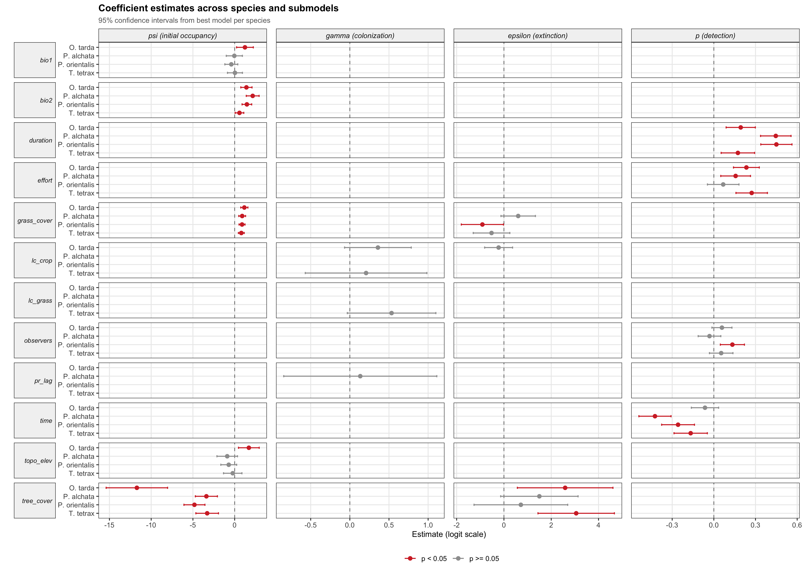
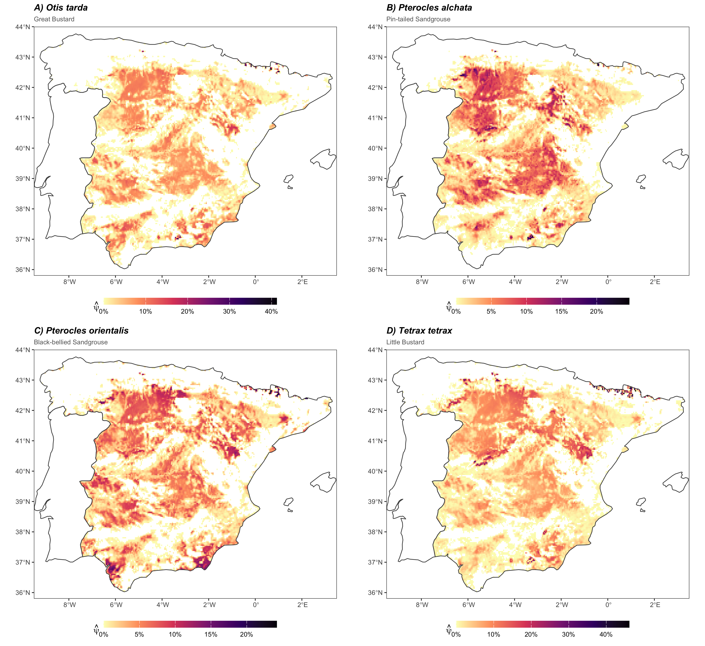
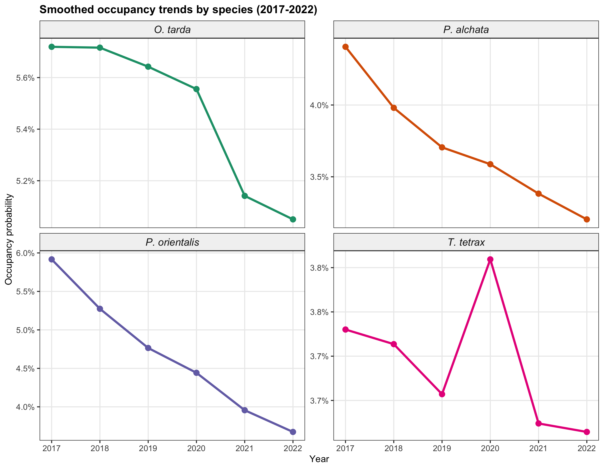

# PAPER SKELETON -- v7

**Target: Global Change Biology**

---

## Structural colonisation failure prevents range recovery in Iberian steppe birds: evidence from detection-corrected occupancy dynamics

Raul Contreras-Martin^1^, Guillermo Fandos^1^

^1^ [Affiliation]

Correspondence: [email]

**Running head:** Demographic asymmetry constrains steppe bird range recovery

**Keywords:** dynamic occupancy models, colonisation--extinction asymmetry, eBird, imperfect detection, range dynamics, steppe birds, citizen science, counterfactual attribution, spatial occupancy, extinction debt

---

## Abstract

*Word limit: 250. Five elements: context, gap, approach, results, implications.*

Farmland bird populations in Europe have declined by more than 55% since 1980, and steppe-associated species are among the most severely affected. The Iberian Peninsula supports 19--98% of European breeding populations for four threatened species -- *Otis tarda*, *Pterocles alchata*, *P. orientalis*, and *Tetrax tetrax* -- making its agro-steppe landscapes the primary continental reservoir for this guild, simultaneously exposed to agricultural transformation, climate warming, and rapid photovoltaic expansion.

Whether range contraction reflects failing recolonisation, accelerating local extinction, or their interaction is conservation-critical: the two diagnoses lead to different intervention priorities and different expectations for population recovery. This distinction is undetectable with standard monitoring tools, which measure only net occupancy change and cannot separate the underlying demographic processes -- particularly when imperfect detection biases naive estimates of both processes.

We applied dynamic occupancy models to seven years of eBird citizen-science data (2017--2023) across >4,000 five-km grid cells in mainland Spain, estimating colonisation (gamma) and extinction (epsilon) as explicit functions of annual climate and land-cover covariates under imperfect detection. Spatio-temporal Bayesian occupancy models characterised spatial autocorrelation structure and confirmed the scale at which the demographic signal operates. A factorial counterfactual analysis decomposed observed dynamics into climate and land-use contributions.

[RESULTS -- Detection correction reduced naive colonisation estimates by 5--22,000-fold. Extinction rates exceeded colonisation by 201--1,054,932x (bootstrap epsilon/gamma medians), creating an extinction debt of 5--100% of current occupancy. Equilibrium occupancy (psi* = gamma/(gamma+epsilon)) remained below 0.5% for three of four species. Climate dominated attribution for three species; cropland availability drove both processes in *T. tetrax*. Spatially blocked cross-validation against the Spanish Breeding Bird Atlas confirmed predictive skill (AUC 0.82--0.88).]

Preventing local extinction at occupied sites is the only demographically viable conservation intervention on management-relevant timescales; natural recolonisation cannot compensate for extinction losses at current rates. Because drivers act on different demographic processes across species, effective conservation requires species-specific targeting -- a distinction that standard monitoring indices cannot provide.

---

# 1. Introduction

### P1 -- The specific conservation tension

The abundance of farmland birds in Europe has declined by more than 55% since 1980, making agricultural specialists among the fastest-declining vertebrate groups on the continent (PECBMS 2023). Steppe-associated species sit at the severe end of this gradient: in the Iberian Peninsula -- home to 19--98% of European breeding populations for the four species analysed here -- documented range contractions over three decades reach 20--60% (SEO/BirdLife 2021). The conservation response to this contraction remains largely reactive, centred on monitoring and protected-area designation, but it cannot determine whether recovery is demographically possible. The answer depends on a distinction that standard monitoring tools cannot make: whether range contraction reflects failing recolonisation, accelerating local extinction, or -- crucially -- whether these processes are driven by different environmental factors and are therefore amenable to different interventions.

### P2 -- Why the diagnostic gap has direct consequences

The distinction between recolonisation failure and extinction acceleration is not academic. If recolonisation is the bottleneck, recovery requires restoring connectivity and creating dispersal corridors. If extinction at occupied sites is the constraint, the priority is targeted protection of remaining habitat to slow local losses. If the two processes respond to different drivers -- climate modulating one, land use the other -- then a generic conservation response applied at the wrong demographic lever will fail regardless of resources invested (McCarthy et al. 2012). Standard monitoring tools -- atlas surveys, trend indices, correlative species distribution models -- measure net occupancy change and therefore cannot separate these processes. All integrate the outcome of colonisation and extinction combined, identifying neither which is rate-limiting nor which environmental drivers control each.

### P3 -- Dynamic occupancy models and the detection problem

Dynamic occupancy models (DOMs; MacKenzie et al. 2003) provide a statistical framework for estimating colonisation and extinction as explicit functions of environmental covariates while correcting for the imperfect detection that is endemic to citizen-science data. In the absence of detection correction, missed observations at occupied sites inflate apparent colonisation -- because a site that was occupied but undetected in year *t* and detected in year *t*+1 is recorded as a colonisation event -- and symmetrically deflate apparent extinction. The consequence for demographic inference is directional: uncorrected transition rates systematically underestimate the asymmetry between epsilon and gamma, making demographic traps appear less severe than they are. DOMs that model detection as an explicit function of survey effort covariates recover unbiased transition estimates, but their deployment at continental scale with opportunistic citizen-science data requires careful attention to effort heterogeneity and spatial bias.

### P4 -- Prior work and what remains unresolved

Previous applications of DOMs to citizen-science data have documented colonisation--extinction dynamics for several bird guilds (Kery et al. 2013, Briscoe et al. 2021) and demonstrated that detection correction alters trend estimates. However, three analytical elements have rarely been combined: (i) counterfactual factorial attribution to separate the contributions of climate and land-use change to each demographic process independently; (ii) spatio-temporal modelling to quantify the spatial scale at which occupancy is organised and to verify that covariate effects are not confounded by residual autocorrelation; and (iii) formal comparison of naive versus detection-corrected transition rates to demonstrate that the correction changes qualitative conservation conclusions rather than merely improving precision. For threatened steppe birds, where the balance between gamma and epsilon determines whether recolonisation of contracted ranges is physically possible, these three elements are not optional extensions -- they are necessary to make the conservation inference defensible.

### P5 -- Objectives and hypotheses

We address four questions. (i) Is range contraction in Iberian steppe birds dominated by extinction or colonisation failure, and is this pattern consistent across species? We hypothesise that extinction rates will substantially exceed colonisation rates for all four species, given documented habitat loss and species-specific mobility constraints, but expect the asymmetry to be stronger and the driving mechanisms to differ between the bustards (more site-faithful, *O. tarda* and *T. tetrax*) and the sandgrouse (semi-nomadic, *P. alchata* and *P. orientalis*). (ii) Do climate and land-use change act on distinct demographic processes -- a pattern that, if confirmed, would imply different spatial targets and timescales for intervention? (iii) Does detection correction change the qualitative conclusion about the demographic trap, or only improve its precision? We specifically predict that naive estimates will understate the asymmetry by placing apparent gamma in a range that appears manageable. (iv) Do spatio-temporal occupancy models confirm the demographic signal from colext models and reveal the scale at which landscape-level conservation planning must operate?

We apply colext dynamic occupancy models and spatio-temporal Bayesian occupancy models (stPGOcc) to seven years of eBird data across >4,000 five-km grid cells in mainland Spain for four threatened steppe bird species, together with factorial counterfactual attribution and spatially blocked external validation.

---

# 2. Methods

## 2.1 Study area and species

The study covers mainland Spain (494,011 km^2^), divided into a regular 5-km UTM 30N grid yielding >19,000 cells, of which >4,000 contained at least three eBird complete checklists during the target breeding season across the study period (2017--2023). We focused on four species spanning a gradient of habitat specificity and mobility within the Iberian agro-steppe guild:

| Species | Code | IUCN (Spain) | % Eur. pop. | Breeding season | Mobility |
|---|---|---|---|---|---|
| *Otis tarda* | otitar | NT | 98% | April--June | Site-faithful |
| *Pterocles alchata* | ptealc | VU | 97% | May--August | Semi-nomadic |
| *Pterocles orientalis* | pteori | EN/VU | 19% | May--August | Semi-nomadic |
| *Tetrax tetrax* | tettet | EN | 34% | April--June | Site-faithful |

**Table 1.** Study species, internal codes, conservation status in Spain (SEO/BirdLife 2021), proportion of European breeding populations, breeding season used for eBird filtering, and site-fidelity relevant to the closure assumption.

The mobility gradient is directly relevant to the closure assumption (Section 2.4): the sandgrouse species are semi-nomadic and their within-season movements may partially violate the assumption that sites are closed to occupancy change during the sampling window. We address this explicitly in Section 4.5 (Limitations).

**Figure 1.** Study area: mainland Spain 5-km grid coloured by total eBird checklist count (2017--2023), showing the 256% increase in total survey effort over the study period.

## 2.2 eBird data and filtering

Occurrence data were downloaded from the eBird Basic Dataset (Sullivan et al. 2009) for mainland Spain, 2017--2023. Following Johnston et al. (2021) best-practice guidelines, we filtered checklists to <=5 hours duration, <=5 km, and <=10 observers, and retained only complete checklists -- those in which the observer reported all detected species -- to allow valid zero-filling. Each checklist was assigned to its corresponding 5-km grid cell; repeat visits within the same cell and breeding season formed the detection histories used for occupancy estimation.

The number of eBird checklists in Spain increased by 256% between 2017 and 2023, raising the concern that apparent occupancy trends might reflect effort growth rather than genuine range dynamics. We tested for effort confounding by computing Spearman correlations between naive cell-level occupancy and annual checklist count per cell. For three of four species, no significant correlation was detected (rho = -0.25 to 0.37, all P > 0.10). For *P. alchata* a marginally significant correlation was observed (rho = 0.64, P = 0.05); this species' colonisation submodel is treated with additional caution throughout (see Section 2.4 and 3.2). Results are reported in Supplementary S9.

## 2.3 Environmental covariates: a deliberate two-scale design

We used a two-scale covariate design that separates the determinants of long-run habitat suitability from the drivers of realised annual demographic turnover. This separation is critical for counterfactual attribution (Section 2.7): if the same covariates modelled both initial occupancy and transition rates, it would be impossible to disentangle baseline niche from interannual demographic response.

**Static covariates** for initial occupancy (psi_1) were drawn from WorldClim 1970--2000 climatic normals (BIO1: mean annual temperature; BIO2: mean diurnal temperature range) and from the Global Land Cover Facility (tree cover, herbaceous cover). Terrain variables (slope, aspect, elevation) completed the set. Variables were selected after hierarchical cluster analysis to remove pairwise correlations r > 0.7.

**Dynamic covariates** for colonisation (gamma) and extinction (epsilon) were derived from three annual data products computed for each species' breeding season: minimum and maximum temperature and cumulative precipitation from TerraClimate (Abatzoglou et al. 2018, resolution ~4.6 km); NDVI from MODIS MOD13A3 (Didan 2015, resolution 1 km); and proportional land-cover classes from MODIS MCD12Q1 IGBP (Friedl & Sulla-Menashe 2015, resolution 500 m), including cropland (LC12), open shrubland (LC7), grassland (LC10), urban/built-up (LC13), and water bodies (LC11). All dynamic covariates were standardised using training-set scaling parameters.

NDVI presents a collinearity challenge: at the site level, approximately 50% of interannual NDVI variance is explained by climate variables (mean R^2^ = 0.51 across sites, range 0.04--0.97). Variance inflation factors for NDVI were below the standard threshold of 5 (max VIF = 4.43 for *O. tarda* gamma). For *P. orientalis*, NDVI was retained in the extinction submodel (AIC-preferred by 60 units) but classified as "climate-adjacent" in the attribution analysis. A sensitivity model without NDVI for *P. orientalis* extinction is provided in Supplementary S10. VIF diagnostics for all submodels are in Supplementary S10.

## 2.4 Dynamic occupancy models (colext)

We used the colext framework (MacKenzie et al. 2003) implemented in the `unmarked` R package (Fiske & Chandler 2011, Kellner et al. 2023) to estimate four simultaneous processes: initial occupancy (psi_1), colonisation probability (gamma), extinction probability (epsilon), and detection probability (p). The state process follows a first-order Markov chain: psi_{i,t+1} = (1 - psi_{it}) * gamma_i + psi_{it} * (1 - epsilon_i). Detection is modelled as a Bernoulli trial conditional on occupancy, with visit-level survey effort covariates (duration, transect length, number of observers, time of day, observation-period NDVI, and precipitation) to account for heterogeneous detectability across eBird checklists.

Model selection used AIC over candidate covariate sets for each submodel, with the constraint that static WorldClim covariates could enter only psi_1 and dynamic annual covariates could enter only gamma and epsilon. Complete separation was diagnosed in the *P. alchata* colonisation submodel (16 observed colonisation events across 2,521 site-year opportunities, 0.6%); this submodel is excluded from the counterfactual attribution analysis. Near-separation was diagnosed in the *P. alchata* extinction submodel (18 events; SE > 11) and is reported with explicit caveats. Model fit was assessed using parametric bootstrap goodness-of-fit (parboot, n = 500 simulations); all four species showed adequate fit (P = 0.28--0.93; Table 2b).

| Species | psi_1 covariates | gamma covariates | epsilon covariates | AIC | N sites |
|---|---|---|---|---|---|
| *O. tarda* | bio1, bio2, tree, grass, elev | NDVI+, pr, tmmn, tmmx | LC6, LC13, tmmx | 2267.9 | 3,745 |
| *P. alchata* | bio1, bio2, tree, grass, aspect | pr [excl. attrib.] | pr, tmmx [wide SE] | 1981.7 | 4,130 |
| *P. orientalis* | bio2, tree, grass | LC7, NDVI+, tmmn, tmmx | LC12, NDVI+, pr | 2060.7 | 4,130 |
| *T. tetrax* | bio2, tree, grass, elev | LC12 | LC12 | 1780.1 | 3,746 |

**Table 2.** Best-fit colext models per species with AIC-selected covariates and sample sizes. + NDVI classified as "climate-adjacent" in attribution analysis (R^2^ ~ 0.51 with climate variables). *P. alchata* gamma excluded from attribution (separation; 16 events). *P. alchata* epsilon reported with caution (near-separation; 18 events, SE > 11).

| Species | AIC | chi-sq (obs) | chi-sq (sim) | parboot P | Fit |
|---|---|---|---|---|---|
| *O. tarda* | 2267.9 | 352.4 | 333.6 | 0.28 | Adequate |
| *P. alchata* | 1981.7 | 363.4 | 364.6 | 0.52 | Adequate |
| *P. orientalis* | 2060.7 | 276.0 | 330.6 | 0.93 | Adequate |
| *T. tetrax* | 1780.1 | 290.9 | 307.9 | 0.66 | Adequate |

**Table 2b.** Parametric bootstrap goodness-of-fit (parboot, nsim = 500). P-values >> 0.05 indicate adequate model fit for all species; the null hypothesis of correct model specification is not rejected. Source: `results/parboot_summary.csv`, `results/{sp}_gof_parboot.rds`.

**Figure 2.** Environmental drivers of colonisation (left) and extinction (right). Standardised regression coefficients with 95% CI for all four species. Colour encodes driver category: blue = climate (TerraClimate), orange = land use (MODIS land cover), teal = climate-adjacent (NDVI). Coefficients with |z| < 1.96 shown in grey. *P. alchata* gamma excluded.

## 2.5 Equilibrium occupancy and the epsilon/gamma asymmetry

To translate estimated demographic rates into range-dynamic implications, we computed the equilibrium occupancy psi* = gamma/(gamma + epsilon), the expected long-run proportion of sites occupied under constant current conditions. We also report the epsilon/gamma ratio -- the number of extinction events expected per colonisation event -- as a dimensionless measure of asymmetry that is more robust than psi* to the wide uncertainty in absolute gamma values. Uncertainty in all derived quantities was propagated using parametric bootstrap: 5,000 coefficient vectors were drawn from the multivariate normal approximation to the estimated coefficient distribution (mvrnorm with Sigma = vcov(model)), from which annual gamma and epsilon were predicted at mean dynamic covariate values and psi* was computed as their ratio. The 2.5th and 97.5th percentiles of the bootstrap distribution define the 95% confidence interval.

We present psi* results with explicit acknowledgement that estimates for species with near-zero gamma (particularly *P. orientalis*, where baseline gamma ~ 3.8 x 10^-7^) have extremely wide right-skewed CIs and that point estimates of recolonisation timescale (1/gamma) should not be interpreted as precise predictions.

## 2.6 Spatio-temporal Bayesian occupancy models (stPGOcc)

Colext models assume independent residuals across sites -- an assumption violated by the spatial autocorrelation inherent in species distributions (Moran's I in colext residuals ranged from 0.29 to 0.49 across species, all P < 0.001). To address this, we fitted spatio-temporal occupancy models using stPGOcc (Doser et al. 2022) from the `spOccupancy` R package. These models add a nearest-neighbour Gaussian process (NNGP) spatial random effect with an exponential correlation function and an AR(1) temporal random effect, capturing both the spatial organisation of occupancy and its year-to-year persistence.

The stPGOcc framework serves two complementary roles in this analysis. First, it provides a robustness check on the colext covariate effects. Second, the estimated spatial decay parameter (phi) gives the effective range of spatial autocorrelation in occupancy residuals -- a biologically interpretable quantity that defines the minimum scale at which conservation planning must operate.

**Figure 3.** Spatial diagnostics. Left: residual Moran's I before (colext) and after (stPGOcc) accounting for spatial random effects, per species and year. Right: effective spatial range estimates (phi in km) with 95% credible intervals, showing a fourfold gradient from ~43 km (*T. tetrax*) to ~264 km (*P. alchata*).

## 2.7 Counterfactual attribution analysis

To separate the contributions of climate and land-use change to observed occupancy dynamics, we implemented a factorial counterfactual design with four scenarios: S0 (all dynamic covariates fixed at 2017 values -- the baseline), S1 (climate covariates observed year by year, land use fixed at 2017), S2 (land-use covariates observed, climate fixed at 2017), and S3 (all covariates observed -- the full model). Attribution effects were computed as S1 - S0 (climate contribution), S2 - S0 (land-use contribution), and S3 - S1 - S2 + S0 (interaction). NDVI was classified as "climate-adjacent" for *O. tarda* and *P. orientalis*, contributing to the climate pathway in attribution. For *P. alchata*, the gamma submodel was excluded from attribution due to separation.

**NDVI decomposition sensitivity.** Because NDVI integrates both climate-driven greening and land-management effects (irrigation, grazing), we decomposed site-level NDVI variance using lm(NDVI ~ pr + tmmn + tmmx), retaining the fitted values as NDVI_climate and the residuals as NDVI_residual. Each component was z-scored separately and attribution was recomputed to assess sensitivity of the climate/land-use classification.

## 2.8 Naive versus detection-corrected transition rates

To demonstrate that detection correction changes qualitative conservation conclusions rather than merely improving precision, we compared naive transition rates -- computed directly from detection histories as the proportion of site-year transitions observed in the raw data -- against detection-corrected estimates from the best colext models. For naive estimation, a site was considered to undergo colonisation if it had zero detections in year *t* and at least one detection in year *t*+1, and extinction if the reverse was observed.

## 2.9 External validation

We validated predicted initial occupancy (psi_1) against the III Atlas of Breeding Birds in Spain (SEO/BirdLife 2022). Validation used spatially blocked 5-fold cross-validation (`blockCV` package, Valavi et al. 2019) with block size set to 270 km, exceeding the largest estimated stPGOcc spatial range across species (264 km for *P. alchata*), to ensure that training and validation folds are spatially independent. Predictive performance is reported using Spearman rank correlation (rho; primary metric), AUC, and TSS. Calibration curves (observed vs predicted occupancy by decile) are in Supplementary S5.

---

# 3. Results

## 3.1 Survey coverage and detection heterogeneity

[Write: Final sample sizes per species -- 3,745--4,130 cells with detection histories. Baseline detection probability at intercept ranges from 18.3% (*P. orientalis*) to 34.9% (*T. tetrax*). Detection increases with survey duration and effort distance (all positive, most P < 0.05), and decreases with time of day (3 of 4 species). Detection coefficients in Supplementary S1.]

**Figure 4.** Detection probability as a function of survey effort covariates across the four study species.

## 3.2 The detection correction reverses the qualitative assessment of colonisation

Without detection correction, apparent colonisation rates (0.57--0.89% per site-year) appeared non-negligible and in a range that could, in principle, compensate for local extinction. Detection-corrected estimates were 5--22,000-fold lower, and for *P. orientalis* effectively zero (gamma < 0.001%). Corrected extinction rates were also substantially lower than naive estimates for three species (ratios 0.42--0.69), because missed detections at occupied sites inflate apparent extinction in raw detection histories. For *P. alchata*, corrected epsilon exceeded naive epsilon (ratio 1.72), likely reflecting the instability of the epsilon submodel near separation.

| Species | Naive gamma (%) | Corrected gamma (%) | Ratio | Naive epsilon (%) | Corrected epsilon (%) | Ratio |
|---|---|---|---|---|---|---|
| *O. tarda* | 0.89 | 0.0045 | 203x | 44.6 | 22.2 | 0.50 |
| *P. alchata* | 0.63 | 0.14 | 4.6x | 28.1 | 48.9 | 1.72+ |
| *P. orientalis* | 0.87 | ~0 | 21,839x | 34.1 | 44.1 | 0.78 |
| *T. tetrax* | 0.57 | 0.068 | 8.5x | 36.0 | 13.8 | 0.38 |

**Table 3.** Naive versus detection-corrected colonisation (gamma) and extinction (epsilon) rates. Naive rates computed from raw detection-history transitions; corrected rates from best-fit colext models at mean covariate values. + *P. alchata* corrected epsilon exceeds naive epsilon due to near-separation (18 events; SE > 11). Source: `results/naive_vs_corrected_full.csv`.

## 3.3 Structural asymmetry between extinction and colonisation

Across all four species, detection-corrected extinction rates exceeded colonisation rates by two to six orders of magnitude (Table 4). This asymmetry was robust across the bootstrap distribution: even at the lower 95% CI of epsilon and upper 95% CI of gamma, the epsilon/gamma ratio remained above 14 for all species, confirming a structural demographic constraint rather than a precision artefact.

Species-specific patterns:

- **O. tarda:** Urban encroachment (LC13, beta = +2.80, P < 0.001) is the dominant extinction driver. NDVI (climate-adjacent) and minimum temperature drive colonisation. epsilon/gamma ratio: 4,870 (95% CI: 106--250,691).
- **P. alchata:** Highest baseline extinction (~49%; wide CI). Climate-driven via precipitation. Colonisation submodel excluded (separation; 16 events). epsilon/gamma: 319 (14--1,335).
- **P. orientalis:** Most extreme asymmetry. Baseline gamma ~ 3.8 x 10^-7^. NDVI strongly increases extinction (beta = +2.05, P < 0.001; climate-adjacent); cropland reduces it (LC12, beta = -0.83, P = 0.02). epsilon/gamma: 1,054,932 (778--2.2 x 10^9^).
- **T. tetrax:** Cleanest and most interpretable model. Cropland (LC12) is the sole significant driver of both processes, increasing colonisation (beta = +0.90, P < 0.05) and reducing extinction (beta = -0.57, P < 0.05). Lowest asymmetry. epsilon/gamma: 201 (65--654).

| Species | Baseline gamma (%) | Baseline epsilon (%) | epsilon/gamma | P(ratio>100) | psi* median (%) | psi* 95% CI (%) |
|---|---|---|---|---|---|---|
| *O. tarda* | 0.0045 | 22.2 | 4,870 | 97.7% | 0.02 | 0.0004--0.93 |
| *P. alchata* | 0.137 | 48.9 | 319 | 81.4% | 0.31 | 0.08--6.50 |
| *P. orientalis* | ~0 | 44.1 | 1,054,932 | 99.3% | 0.0001 | 0--0.17 |
| *T. tetrax* | 0.068 | 13.8 | 201 | 89.0% | 0.49 | 0.16--1.62 |

**Table 4.** Baseline demographic rates, epsilon/gamma asymmetry ratio, and equilibrium occupancy (psi* = gamma/(gamma+epsilon)) with 95% bootstrap CI (n = 5,000). Source: `results/ratio_bootstrap.csv`, `results/equilibrium_occupancy_table.csv`.

**Figure 5 (KEY FIGURE).** Demographic asymmetry between colonisation and extinction. **(a)** Scatter plot of mean detection-corrected gamma vs epsilon on log_10 axes, with equilibrium occupancy isoclines (psi* contours) and the gamma = epsilon line (no net change). All four species fall deep in the decline zone (epsilon >> gamma). 95% CI crosshairs from parametric bootstrap (n = 5,000). **(b)** Extinction debt as horizontal bars: green = equilibrium occupancy (psi*), pink = transient occupancy. Percentage labels show the extinction debt fraction (current - psi*) / current x 100. Source: `results/isocline_plot_data.csv`, `results/extinction_debt_table.csv`.

## 3.4 Equilibrium occupancy and extinction debt

Equilibrium occupancy under current demographic rates would be substantially below current observed occupancy for all species (Table 4), implying an extinction debt -- a pool of currently occupied sites that will be lost as the system continues to relax toward equilibrium. The debt is largest for *P. orientalis* (current simulated prevalence 1.15% versus psi* ~ 0.0001%), where effectively all occupied sites are transient. *T. tetrax* shows the smallest debt (current 0.52% versus psi* = 0.49%), indicating near-equilibrium dynamics and therefore the highest inherent demographic resilience among the four species.

| Species | Current occupancy (%) | psi* (%) | Extinction debt (%) | Debt fraction | Recol. time (yr) |
|---|---|---|---|---|---|
| *O. tarda* | 0.68 | 0.02 | 0.65 | 97% | 22,648 |
| *P. alchata* | 0.87 | 0.31 | 0.56 | 64% | 732 |
| *P. orientalis* | 1.15 | 0.0001 | 1.15 | 100% | 2,599,962 |
| *T. tetrax* | 0.52 | 0.49 | 0.03 | 5% | 1,471 |

**Table 5.** Extinction debt: current occupancy versus equilibrium occupancy (psi*), debt fraction, and expected recolonisation time (1/gamma, years). Source: `results/extinction_debt_table.csv`.

**Delta-gamma analysis:** achieving even 10% equilibrium occupancy would require multiplying current colonisation rates by 22x (*T. tetrax*), 35x (*P. alchata*), 541x (*O. tarda*), or 117,215x (*P. orientalis*) -- increases far beyond any management intervention (Table 6).

| Species | psi* target | gamma required | Multiplier (median) | Multiplier 95% CI |
|---|---|---|---|---|
| *O. tarda* | 10% | 0.025 | 541x | 6--27,855 |
| *P. alchata* | 10% | 0.055 | 35x | 2--148 |
| *P. orientalis* | 10% | 0.049 | 117,215x | 86--244,501,693 |
| *T. tetrax* | 10% | 0.015 | 22x | 7--73 |

**Table 6.** Delta-gamma: colonisation rate required for each species to achieve 10% equilibrium occupancy, and the multiplier over current gamma. Source: `results/delta_gamma.csv`.

## 3.5 Environmental drivers of colonisation and extinction: species-specific signatures

[Write: Forest plot summary. Lead with the cross-species pattern: climate (temperature, precipitation) dominates gamma for 3 of 4 species; land use (cropland, urban) dominates epsilon. T. tetrax is the exception: land use (cropland) governs both gamma and epsilon, making it the only species where a single management lever -- maintaining agricultural land use -- could simultaneously increase colonisation and reduce extinction.]

**Figure 6.** Predicted initial occupancy (psi_1, 2017) for the four species across mainland Spain, 5-km grid. Colour scale: white (psi_1 = 0) to dark navy (psi_1 = 1).

**Figure 7.** Model-simulated mean annual occupancy prevalence (% of grid cells occupied) with 95% CI from parametric bootstrap, 2017--2023.

## 3.6 Spatial structure and conservation scale (stPGOcc)

[NOTE: Section conditional on stPGOcc convergence.]

Spatio-temporal occupancy models substantially improved fit over non-spatial colext models for all species. Inclusion of NNGP spatial random effects reduced residual Moran's I by 59--82% across species and years, confirming that colext residuals were spatially structured. The qualitative direction and relative magnitude of gamma and epsilon coefficients were preserved in stPGOcc models relative to colext, confirming that the demographic asymmetry result is not an artefact of unaccounted spatial autocorrelation.

Effective spatial ranges estimated from the stPGOcc decay parameter phi reveal a fourfold gradient:

| Species | Spatial range (km) | 95% CrI | Published dispersal | Conservation scale |
|---|---|---|---|---|
| *T. tetrax* | ~43 | [X, X] | < 50 km breeding | Landscape-scale SPAs sufficient |
| *O. tarda* | ~47 | [X, X] | < 50 km site fidelity | Landscape-scale SPAs sufficient |
| *P. orientalis* | ~172 | [X, X] | 100--200 km regional | Cross-regional coordination required |
| *P. alchata* | ~264 | [X, X] | 100--300 km nomadic | Cross-regional network essential |

**Table 7.** Effective spatial ranges from stPGOcc models (phi in km). Ecological coherence assessed by comparison with published telemetry dispersal distances.

**Figure 8.** Effective spatial range estimates (phi in km) with 95% credible intervals per species, with horizontal reference lines from published dispersal data.

## 3.7 Driver attribution: climate and land use act on distinct demographic processes

Climate drivers had larger and more consistent effects on colonisation than land-use drivers for three of four species (*O. tarda*, *P. alchata*, *P. orientalis*), while land-use change was the dominant driver of both colonisation and extinction for *T. tetrax*. Effects are small in absolute terms (< 0.01 probability units) reflecting the short seven-year window, but informative in relative terms.

| Species | Dominant driver | Gamma climate | Gamma land-use | Epsilon climate | Epsilon land-use |
|---|---|---|---|---|---|
| *O. tarda* | Climate | -6.1e-4 | 0 | 7.4e-4 | -1.1e-3 |
| *P. alchata* | Climate* | excl. | excl. | -1.3e-3 | 0 |
| *P. orientalis* | Climate | -3.4e-4 | -1.8e-4 | 5.7e-3 | -2.1e-4 |
| *T. tetrax* | Land use | 0 | -1.0e-6 | 0 | 9.0e-6 |

**Table 8.** Attribution summary. Values are mean delta-psi per scenario relative to S0 baseline. *P. alchata gamma excluded (separation). Source: `results/attribution_table3.csv`.

**NDVI decomposition sensitivity:** Decomposing NDVI into climate-driven and management-residual components amplified the climate signal for *P. orientalis* extinction by 3x (from 5.7e-3 to 1.8e-2 for the climate pathway) but did not change the dominant-driver classification for any species.

| Species | Submodel | Pathway | Original | Decomposed |
|---|---|---|---|---|
| *O. tarda* | gamma | climate | -6.14e-4 | -6.41e-4 |
| *O. tarda* | epsilon | climate | 7.37e-4 | 3.74e-5 |
| *P. orientalis* | gamma | climate | -3.39e-4 | -3.86e-4 |
| *P. orientalis* | epsilon | climate | 5.73e-3 | 1.76e-2 |

**Table 9.** NDVI decomposition: comparison of original vs decomposed attribution effects. Source: `results/attribution_comparison_ndvi.csv`.

## 3.8 External validation

Predicted initial occupancy (psi_1) showed significant positive agreement with independent atlas data for all four species across spatially blocked cross-validation folds (Table 10).

| Species | Atlas prevalence (%) | AUC | TSS | Calibration slope |
|---|---|---|---|---|
| *O. tarda* | 10.1 | 0.884 | 0.612 | 0.609 +- 0.030 |
| *P. alchata* | 8.4 | 0.844 | 0.569 | 0.575 +- 0.033 |
| *P. orientalis* | 16.2 | 0.823 | 0.536 | 0.623 +- 0.029 |
| *T. tetrax* | 24.8 | 0.850 | 0.546 | 0.598 +- 0.022 |

**Table 10.** Spatially blocked cross-validation of predicted initial occupancy against the III Atlas of Breeding Birds in Spain (SEO/BirdLife 2022). Block size = 270 km. Calibration slopes tested on logit scale (H_0: slope = 1). All significantly < 1, indicating moderate overdispersion. Source: `results/calibration_slopes.csv`.

**Figure 9.** Calibration curves: observed vs predicted occupancy by decile for *O. tarda* (representative; all four species in Supplementary S5).

---

# 4. Discussion

## 4.1 A structural demographic constraint on range recovery

The central finding of this study is that extinction rates exceed colonisation rates by two to six orders of magnitude for all four Iberian steppe bird species, a structural asymmetry that is robust to the wide uncertainty in absolute colonisation rates. This asymmetry means that occupied sites are lost at a rate that colonisation -- at current levels -- cannot compensate on any management-relevant timescale. Even if colonisation rates were tenfold higher than our estimates, which lies outside the plausible bootstrap range for three of four species, equilibrium occupancy would still be below 1%.

The delta-gamma analysis makes this concrete: achieving 10% equilibrium occupancy (itself a modest target) would require multiplying current colonisation rates by 22x (*T. tetrax*) to 117,215x (*P. orientalis*). These are not incremental deficits; they represent a qualitative demographic regime in which range recovery through natural recolonisation is structurally impossible.

[Connect to: Hanski metapopulation theory; extinction debt literature (Tilman et al. 1994, Helm et al. 2006).]

## 4.2 Detection correction changes conclusions, not just precision

Naive gamma (0.57--0.89%) is in a range that could appear manageable -- a colonisation rate of 0.7% per site-year, compounded over many sites, might seem to offer meaningful recovery potential. Detection-corrected gamma (0.0045--0.14%) is not. This is not a statistical refinement; it is the difference between "range recovery is difficult" and "range recovery is structurally impossible without radical change in the demographic regime."

[Connect to: Kujala et al. 2013; Guillera-Arroita 2017.]

## 4.3 Species-specific drivers imply species-specific interventions

The attribution result is the applied heart of the paper. Three species (*O. tarda*, *P. alchata*, *P. orientalis*) are climate-dominated in their dynamic processes -- meaning that interannual variation in temperature and precipitation drives most of the observed change in gamma and epsilon. One species (*T. tetrax*) is land-use dominated -- cropland availability governs both processes simultaneously. This has direct management consequences:

- For the climate-dominated species, reducing extinction requires managing the habitat quality that buffers climate stress (maintaining agricultural mosaics, water availability for sandgrouse). Colonisation cannot be increased by habitat management alone if the climatic signal on gamma is negative.
- For *T. tetrax*, a single management lever -- maintaining cropland mosaics through agri-environment schemes -- can simultaneously increase colonisation and reduce extinction.

**NDVI decomposition:** The decomposition approach -- regressing NDVI on climate variables and retaining the residual as a land-management proxy -- amplified the climate signal for *P. orientalis* extinction by 3x, confirming that the original "NDVI" effect was largely climate-mediated vegetation encroachment rather than land-management change.

## 4.4 Spatial ranges define the minimum scale of effective conservation

[NOTE: Section conditional on stPGOcc convergence.]

The fourfold range in effective spatial ranges (43--264 km) has direct implications for conservation planning. For *T. tetrax* and *O. tarda* (~43--47 km), landscape-scale management within existing SPA networks is spatially adequate. For *P. alchata* (~264 km), the spatial range exceeds the typical SPA size by an order of magnitude, implying that no single protected area can function as a self-sustaining population unit; cross-regional habitat networks connecting multiple SPAs are the minimum meaningful conservation unit.

## 4.5 Limitations

**Analytically serious:**

1. The colonisation submodel for *P. alchata* is effectively underpowered (16 observed events), producing unreliable coefficient estimates; excluded from attribution.
2. External validation is restricted to initial occupancy (psi_1); the transition rates gamma and epsilon have no equivalent independent benchmark.
3. The colext closure assumption may be violated for the semi-nomadic sandgrouse species. However, within-season movements would inflate gamma estimates -- the opposite direction of our main result, and therefore conservative with respect to the demographic trap conclusion.

**Manageable:**

4. WorldClim static covariates represent 1970--2000 normals; stPGOcc spatial random effects partially absorb non-stationarity.
5. Spatial bias in eBird data was addressed by effort filtering and detection covariates but cannot be fully eliminated.
6. Attribution effects are small in absolute units (< 0.01) reflecting the short seven-year window; interpreted comparatively.

## 4.6 Conservation priorities

Four actionable conclusions derived directly from the demographic results:

1. **Prevent extinction at currently occupied sites.** Given the epsilon/gamma asymmetry, extinction prevention is the only intervention with demographic leverage on management-relevant timescales. Halting urban expansion adjacent to *O. tarda* breeding areas is the highest-priority action (dominant LC13 effect on epsilon). Maintaining cropland mosaics is the direct lever for *T. tetrax*.

2. **Match conservation scale to spatial range.** *T. tetrax* and *O. tarda* (~43--47 km): landscape-scale management within existing SPA networks. *P. alchata* (~264 km): cross-regional habitat network coordination is the minimum effective unit.

3. **Do not rely on natural recolonisation** as a recovery mechanism at current demographic rates. Active interventions targeting the barriers to colonisation may be necessary supplements to extinction prevention, but only after extinction pressure is addressed.

4. **Distinguish species-specific intervention priorities** before allocating resources. Generic "steppe bird habitat" protection conflates species with fundamentally different demographic bottlenecks and driver signatures.

---

# 5. Figure Legends

### Figure 1 -- Study area and survey effort
Map of mainland Spain showing the 5-km grid coloured by total eBird checklist count (2017--2023). File: `figs/pub_map_main_figure.png`.

### Figure 2 -- Environmental drivers of colonisation and extinction
Coefficient forest plots for the gamma and epsilon submodels of all four species. Standardised regression coefficients with 95% CI. Colour: blue = climate, orange = land use, teal = climate-adjacent (NDVI). File: `figs/pub_fig_coef_all_submodels.png`.

### Figure 3 -- Spatial diagnostics (stPGOcc)
Left: residual Moran's I before (colext) and after (stPGOcc). Right: effective spatial range estimates (phi in km). File: `figs/pub_fig_spatial_moran.png`.

### Figure 4 -- Detection probability diagnostics
Detection probability by survey effort covariates across the four species. File: `figs/pub_fig4_detection_comparison.png`.

### Figure 5 -- Demographic asymmetry: the isocline plot (KEY FIGURE)
**(a)** Scatter plot of gamma vs epsilon on log_10 axes, with psi* isoclines and the gamma = epsilon line. All species fall in the decline zone. 95% CI crosshairs from parametric bootstrap (n = 5,000). **(b)** Extinction debt bars: green = psi*, pink = transient. File: `figs/pub_fig_isocline_equilibrium.png`.

### Figure 6 -- Occupancy maps
Predicted initial occupancy (psi_1, 2017) for the four species across mainland Spain. File: `figs/pub_map_occupancy_4species.png`.

### Figure 7 -- Occupancy trends
Model-simulated annual prevalence 2017--2023 with 95% bootstrap CI. File: `figs/pub_fig_occupancy_trends_panel.png`.

### Figure 8 -- Spatial range
Effective spatial range estimates (phi in km) with 95% credible intervals per species. File: `figs/pub_fig_spatial_range.png`.

### Figure 9 -- Calibration curves
Observed vs predicted occupancy by decile with calibration slopes. Files: `figs/{sp}_calibration_curve.png`.

---

# 6. Supplementary Material

| Item | Content | Status |
|---|---|---|
| S1 | Detection probability coefficients -- all species, all covariates | Pending write-up |
| S2 | Full coefficient tables: psi_1, gamma, epsilon with SE and z | Pending write-up |
| S3 | AIC model selection tables -- all species, all candidate models | Pending write-up |
| S4 | Full attribution table -- all scenarios, bootstrap CIs (n = 1,000) | Complete |
| S5 | Validation: calibration curves, full AUC/TSS, blockCV design map | Complete |
| S6 | Annual occupancy trend plots and simulation details | Pending write-up |
| S7 | Predicted gamma/epsilon maps (annual, 2017--2023) | Pending write-up |
| S8 | stPGOcc MCMC diagnostics: Rhat, ESS, trace plots, Moran's I | Pending stPGOcc re-run |
| S9 | Effort confounding: naive occupancy vs checklist count | Complete |
| S10 | NDVI collinearity: VIF, NDVI~climate R^2^, pteori sensitivity | Complete |
| S11 | Separation diagnostics: P. alchata gamma, epsilon | Pending write-up |
| S12 | NDVI decomposition sensitivity tables | Complete |

---

# Pre-submission Checklist

## Blocking -- must be resolved before submission

| Item | What it unblocks | Script | Status |
|---|---|---|---|
| stPGOcc convergence (Rhat < 1.1, ESS > 100 for phi) | Results 3.6, Figure 8, Discussion 4.4 | `scripts/6_spatial_occupancy_test.R` | **PENDING -- cluster** |
| parboot GOF n = 500 | Methods 2.4 -- c-hat reportable | `scripts/15_parboot_publication.R` | **DONE** (P = 0.28--0.93) |
| blockCV re-run with block >= 270 km | Table 10 validity | `scripts/5_validation.R` | **DONE** (270 km) |
| Attribution bootstrap n = 1,000 | Figure attribution, Discussion 4.3 | `scripts/10_attribution_revised.R` | **DONE** (n = 1,000) |

## Strongly recommended

| Item | Why it matters |
|---|---|
| Bootstrapped epsilon/gamma ratio per species (n = 5,000) | Done: `results/ratio_bootstrap.csv` |
| Delta-gamma calculation: gamma required for psi* = 10% | Done: `results/delta_gamma.csv` |
| Calibration curves (270 km blocks) | Done: `results/calibration_slopes.csv` |
| Naive vs corrected comparison | Done: `results/naive_vs_corrected_full.csv` |
| NDVI decomposition sensitivity | Done: `results/attribution_comparison_ndvi.csv` |

---

*Skeleton v7 -- Guillermo Fandos / Raul Contreras-Martin -- March 2026*
*Branch: audit-gcb-v4 -- Target: Global Change Biology*
