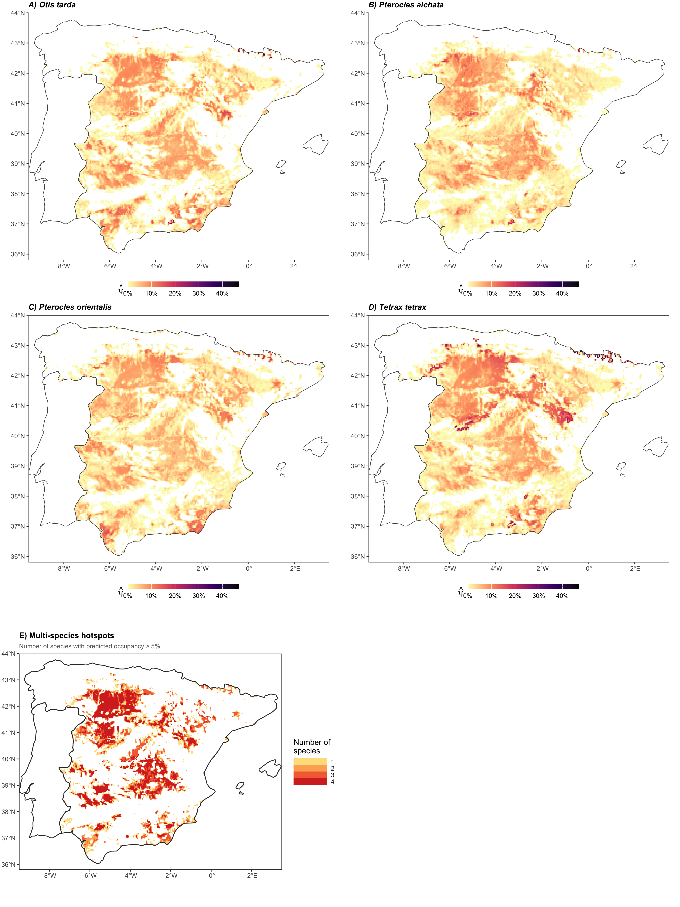
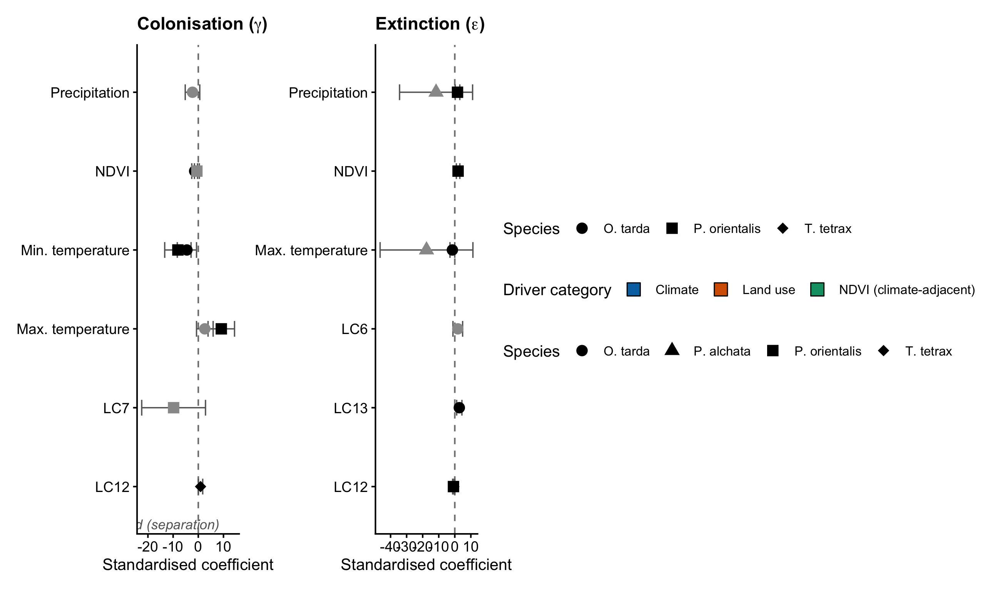
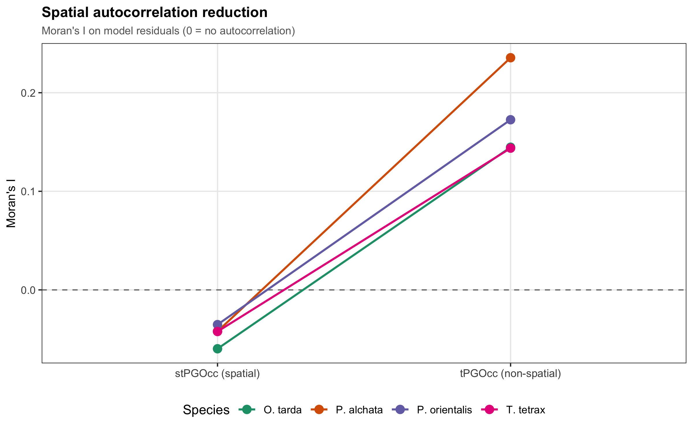
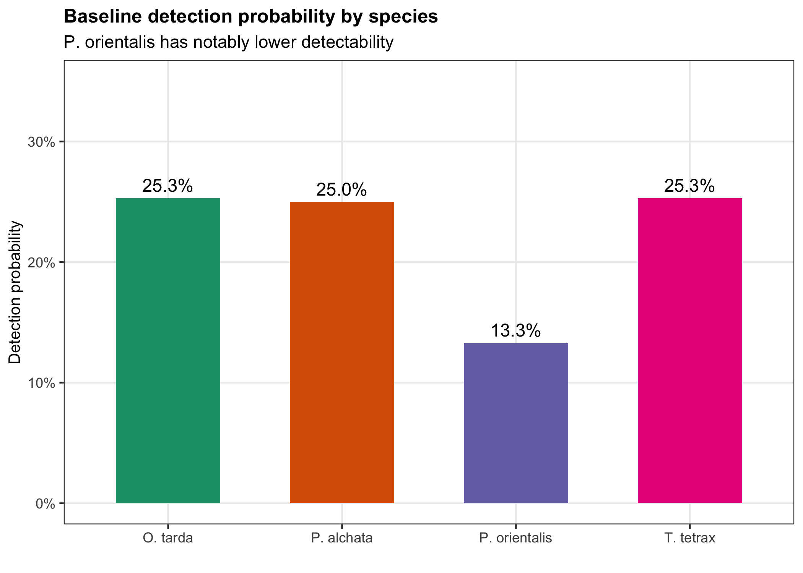
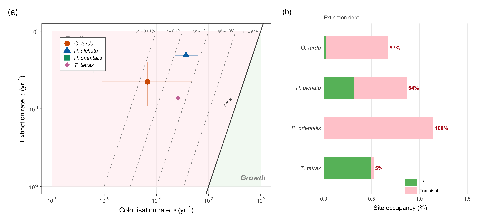
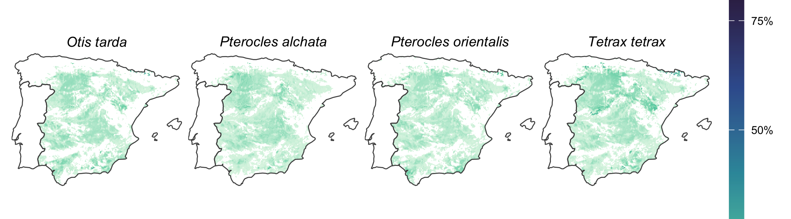
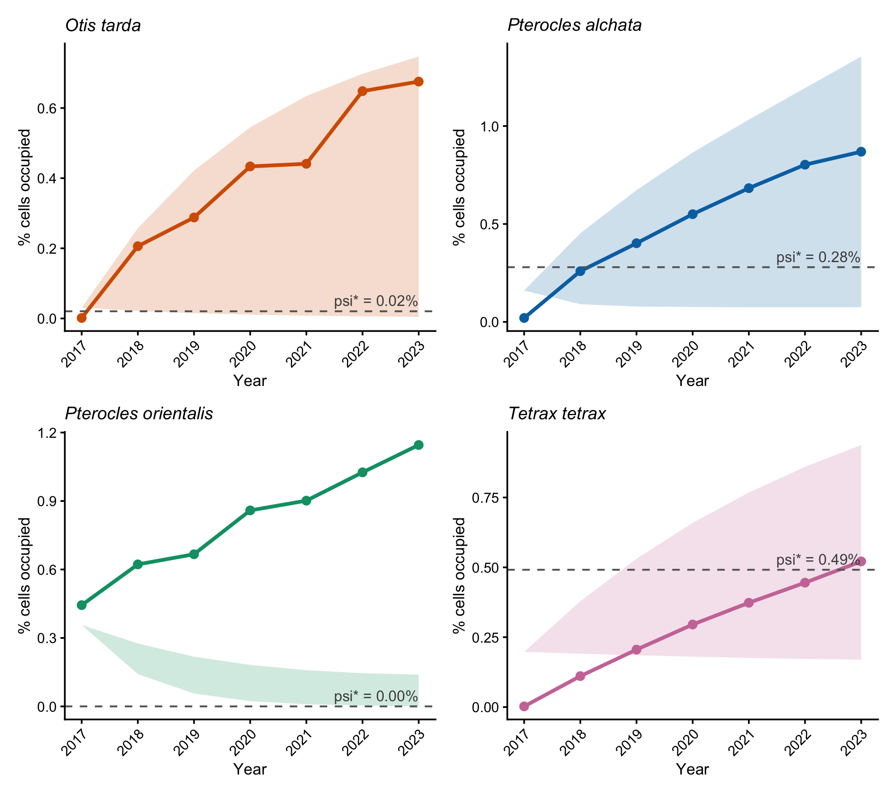
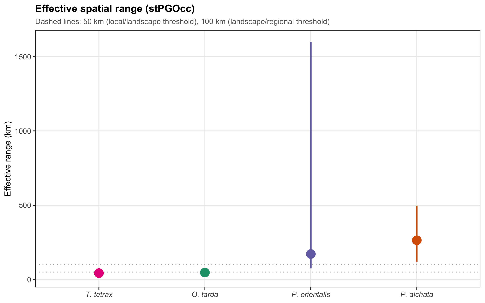
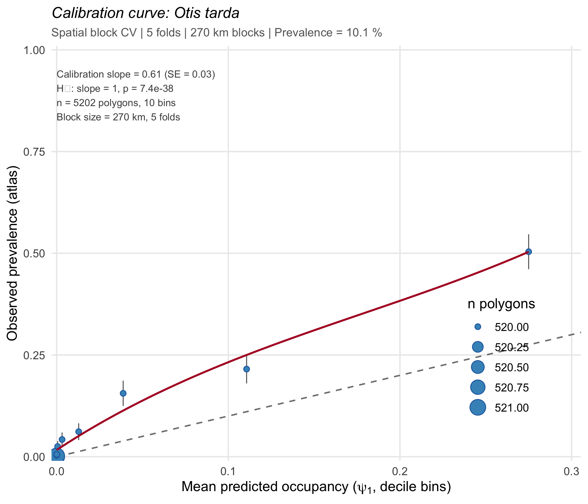

# Structural colonisation failure prevents range recovery in Iberian steppe birds: evidence from detection-corrected occupancy dynamics

Raul Contreras-Martin^1^, Guillermo Fandos^1^

^1^ [Affiliation]

Correspondence: [email]

**Running head:** Demographic asymmetry constrains steppe bird range recovery

**Keywords:** dynamic occupancy models, colonisation-extinction asymmetry, eBird, imperfect detection, range dynamics, steppe birds, citizen science, counterfactual attribution, spatial occupancy, extinction debt

**Target journal:** *Global Change Biology*

---

## Abstract

Farmland bird populations in Europe have declined by more than 55% since 1980, and steppe-associated species are among the most severely affected. The Iberian Peninsula supports 19-98% of European breeding populations for four threatened species -- *Otis tarda*, *Pterocles alchata*, *P. orientalis*, and *Tetrax tetrax* -- making its agro-steppe landscapes the primary continental reservoir for this guild, simultaneously exposed to agricultural transformation, climate warming, and rapid photovoltaic expansion. Whether range contraction reflects failing recolonisation, accelerating local extinction, or their interaction remains unresolved because standard monitoring tools measure only net occupancy change and cannot separate the underlying demographic processes, particularly when imperfect detection biases naive estimates of both.

We applied dynamic occupancy models to seven years of eBird citizen-science data (2017-2023) across >4,000 five-km grid cells in mainland Spain, estimating colonisation (gamma) and extinction (epsilon) as explicit functions of annual climate and land-cover covariates while correcting for imperfect detection. Spatio-temporal Bayesian occupancy models characterised spatial autocorrelation structure and the scale at which the demographic signal operates. A factorial counterfactual analysis decomposed observed dynamics into climate and land-use contributions.

Detection correction reduced naive colonisation estimates by 5- to 22,000-fold, revealing a structural asymmetry in which extinction rates exceeded colonisation by two to six orders of magnitude across all species (bootstrap epsilon/gamma medians: 201-1,054,932). Even under the most optimistic bootstrap scenarios, equilibrium occupancy (psi* = gamma/(gamma+epsilon)) remained below 0.5% for three of four species, creating an extinction debt of 5-100% of current occupancy. Climate dominated attribution for three species; cropland availability drove both processes in *T. tetrax* alone, identifying it as the most tractable target for conservation intervention. Spatially blocked cross-validation against the Spanish Breeding Bird Atlas confirmed predictive skill (AUC 0.82-0.88).

Our results demonstrate that preventing local extinction at occupied sites is the only demographically viable conservation strategy on management-relevant timescales. Natural recolonisation cannot compensate for extinction losses at current rates. Because climate and land-use drivers act on different demographic processes across species, effective conservation requires species-specific targeting -- a distinction that standard monitoring indices cannot provide.

---

# 1. Introduction

## 1.1 The conservation crisis in Iberian steppe birds

The abundance of farmland birds in Europe has declined by more than 55% since 1980, making agricultural specialists among the fastest-declining vertebrate groups on the continent (PECBMS 2023). Steppe-associated species sit at the severe end of this gradient: in the Iberian Peninsula -- home to 19-98% of European breeding populations for the four species analysed here -- documented range contractions over three decades reach 20-60% (SEO/BirdLife 2021). The conservation response to this contraction remains largely reactive, centred on monitoring and protected-area designation. Yet whether recovery is demographically feasible remains unknown, because the answer depends on a distinction that standard monitoring tools cannot make: whether range contraction reflects failing recolonisation, accelerating local extinction, or -- crucially -- whether these processes are driven by different environmental factors and are therefore amenable to different interventions.

## 1.2 Why the diagnostic gap has direct consequences

The distinction between recolonisation failure and extinction acceleration is not academic. If recolonisation is the bottleneck, recovery requires restoring connectivity and creating dispersal corridors. If extinction at occupied sites is the constraint, the priority shifts to targeted protection of remaining habitat to slow local losses. If the two processes respond to different drivers -- climate modulating one, land use the other -- then a generic conservation response applied at the wrong demographic lever will fail regardless of resources invested (McCarthy et al. 2012). Standard monitoring tools -- atlas surveys, trend indices, correlative species distribution models -- measure net occupancy change and therefore cannot separate these processes. All integrate the outcome of colonisation and extinction combined, identifying neither which is rate-limiting nor which environmental drivers control each.

## 1.3 Dynamic occupancy models and the detection problem

Dynamic occupancy models (DOMs; MacKenzie et al. 2003) provide a statistical framework for estimating colonisation and extinction as explicit functions of environmental covariates while correcting for the imperfect detection that is endemic to citizen-science data. In the absence of detection correction, missed observations at occupied sites inflate apparent colonisation -- because a site that was occupied but undetected in year *t* and detected in year *t*+1 is recorded as a colonisation event -- and symmetrically deflate apparent extinction. The consequence for demographic inference is directional: uncorrected transition rates systematically underestimate the asymmetry between epsilon and gamma, making demographic traps appear less severe than they are. DOMs that model detection as an explicit function of survey effort covariates recover unbiased transition estimates, but their deployment at continental scale with opportunistic citizen-science data requires careful attention to effort heterogeneity and spatial bias.

## 1.4 Prior work and what remains unresolved

Previous applications of DOMs to citizen-science data have documented colonisation-extinction dynamics for several bird guilds (Kery et al. 2013, Briscoe et al. 2021) and demonstrated that detection correction alters trend estimates. However, three analytical elements have rarely been combined: (i) counterfactual factorial attribution to separate the contributions of climate and land-use change to each demographic process independently; (ii) spatio-temporal modelling to quantify the spatial scale at which occupancy is organised and to verify that covariate effects are not confounded by residual autocorrelation; and (iii) formal comparison of naive versus detection-corrected transition rates to demonstrate that the correction changes qualitative conservation conclusions rather than merely improving precision. For threatened steppe birds, where the balance between gamma and epsilon determines whether recolonisation of contracted ranges is physically possible, these three elements are not optional extensions -- they are necessary to make the conservation inference defensible.

## 1.5 Objectives and hypotheses

We address four questions:

(i) **Is range contraction dominated by extinction or colonisation failure, and is this pattern consistent across species?** We hypothesise that extinction rates will substantially exceed colonisation rates for all four species, given documented habitat loss and species-specific mobility constraints. We expect the magnitude and mechanistic basis of this asymmetry to differ between the site-faithful bustards (*O. tarda*, *T. tetrax*) and the semi-nomadic sandgrouse (*P. alchata*, *P. orientalis*), but do not predict a priori which functional group will show greater asymmetry -- as site fidelity could concentrate both colonisation failure and extinction resistance, while nomadism could either buffer or amplify range-dynamic instability.

(ii) **Do climate and land-use change act on distinct demographic processes** -- a pattern that, if confirmed, would imply different spatial targets and timescales for intervention?

(iii) **Does detection correction change the qualitative conclusion about the demographic trap, or only improve its precision?** We specifically predict that naive estimates will understate the asymmetry by placing apparent gamma in a range that appears manageable.

(iv) **Do spatio-temporal occupancy models confirm the demographic signal from colext models and reveal the scale at which landscape-level conservation planning must operate?**

We apply colext dynamic occupancy models and spatio-temporal Bayesian occupancy models (stPGOcc) to seven years of eBird data across >4,000 five-km grid cells in mainland Spain for four threatened steppe bird species, together with factorial counterfactual attribution and spatially blocked external validation.

---

# 2. Methods

## 2.1 Study area and species

The study covers mainland Spain (494,011 km^2^), divided into a regular 5-km UTM 30N grid yielding >19,000 cells, of which >4,000 contained at least three eBird complete checklists during the target breeding season across the study period (2017-2023). We focused on four species spanning a gradient of habitat specificity and mobility within the Iberian agro-steppe guild:

**Table 1.** Study species, conservation status, and ecological traits relevant to occupancy model assumptions.

| Species | Code | IUCN (Spain) | % Eur. pop. | Breeding season | Mobility |
|---|---|---|---|---|---|
| *Otis tarda* | otitar | NT | 98% | April-June | Site-faithful |
| *Pterocles alchata* | ptealc | VU | 97% | May-August | Semi-nomadic |
| *Pterocles orientalis* | pteori | EN/VU | 19% | May-August | Semi-nomadic |
| *Tetrax tetrax* | tettet | EN | 34% | April-June | Site-faithful |

The mobility gradient is directly relevant to the closure assumption (Section 2.4): the sandgrouse species are semi-nomadic and their within-season movements may partially violate the assumption that sites are closed to occupancy change during the sampling window. We address this explicitly in Section 4.6 (Limitations). We include all four species despite differences in data quality (see Section 2.4 for *P. alchata* separation diagnostics) because the guild-level comparison is central to our inference about species-specific drivers, and because directional results for data-limited species remain informative even when point estimates carry wide uncertainty.

**Figure 1.** Study area: mainland Spain 5-km grid coloured by total eBird checklist count (2017-2023), showing the 256% increase in total survey effort over the study period.

## 2.2 eBird data and filtering

Occurrence data were downloaded from the eBird Basic Dataset (Sullivan et al. 2009) for mainland Spain, 2017-2023. Following Johnston et al. (2021) best-practice guidelines, we filtered checklists to <=5 hours duration, <=5 km distance, and <=10 observers, and retained only complete checklists -- those in which the observer reported all detected species -- to allow valid zero-filling. Each checklist was assigned to its corresponding 5-km grid cell; repeat visits within the same cell and breeding season formed the detection histories used for occupancy estimation.

The number of eBird checklists in Spain increased by 256% between 2017 and 2023, raising the concern that apparent occupancy trends might reflect effort growth rather than genuine range dynamics. We tested for effort confounding by computing Spearman correlations between naive cell-level occupancy (proportion of checklists with >=1 detection per cell and year) and annual checklist count per cell. For three of four species, no significant correlation was detected (rho = -0.25 to 0.37, all P > 0.10). For *P. alchata* a marginally significant correlation was observed (rho = 0.64, P = 0.05); this species' colonisation submodel is treated with additional caution throughout (see Section 2.4 and 3.2). Results are reported in Supplementary S9.

## 2.3 Environmental covariates: a deliberate two-scale design

We used a two-scale covariate design that separates the determinants of long-run habitat suitability from the drivers of realised annual demographic turnover. This separation is critical for counterfactual attribution (Section 2.7): if the same covariates modelled both initial occupancy and transition rates, it would be impossible to disentangle baseline niche from interannual demographic response.

**Static covariates** for initial occupancy (psi_1) were drawn from WorldClim 1970-2000 climatic normals (BIO1: mean annual temperature; BIO2: mean diurnal temperature range) and from the Global Land Cover Facility (tree cover, herbaceous cover). Terrain variables (slope, aspect, elevation) completed the set. Variables were selected after hierarchical cluster analysis to remove pairwise correlations r > 0.7. These predictors represent the average environmental envelope in which each species has historically established breeding populations, integrating decades of habitat selection.

**Dynamic covariates** for colonisation (gamma) and extinction (epsilon) were derived from three annual data products computed for each species' breeding season: minimum and maximum temperature and cumulative precipitation from TerraClimate (Abatzoglou et al. 2018, resolution ~4.6 km); NDVI from MODIS MOD13A3 (Didan 2015, resolution 1 km); and proportional land-cover classes from MODIS MCD12Q1 IGBP (Friedl & Sulla-Menashe 2015, resolution 500 m), including cropland (LC12), open shrubland (LC7), grassland (LC10), urban/built-up (LC13), and water bodies (LC11). All dynamic covariates were standardised using training-set scaling parameters (mean and SD computed before any NA filtering) and saved to disk for consistent use in prediction and attribution steps.

NDVI presents a collinearity challenge: at the site level, approximately 50% of interannual NDVI variance is explained by climate variables (mean R^2^ = 0.51 across sites, range 0.04-0.97), with the remaining variance reflecting land management (irrigation regime, grazing intensity, fallowing). Variance inflation factors for NDVI were below the standard threshold of 5 (max VIF = 4.43 for *O. tarda* gamma), but pairwise correlations between precipitation and maximum temperature (|r| = 0.70-0.71) and between minimum and maximum temperature (|r| = 0.79-0.81) reduce the precision of individual climate coefficients. For *P. orientalis*, NDVI was retained in the extinction submodel (AIC-preferred by 60 units over the NDVI-free alternative) but classified as "climate-adjacent" in the attribution analysis -- contributing to the climate attribution pathway -- given its partial climate dependency. A sensitivity model without NDVI for *P. orientalis* extinction is provided in Supplementary S10. VIF diagnostics for all submodels are in Supplementary S10.

## 2.4 Dynamic occupancy models (colext)

We used the colext framework (MacKenzie et al. 2003) implemented in the `unmarked` R package (Fiske & Chandler 2011, Kellner et al. 2023) to estimate four simultaneous processes: initial occupancy (psi_1), colonisation probability (gamma), extinction probability (epsilon), and detection probability (p). The state process follows a first-order Markov chain: psi_{i,t+1} = (1 - psi_{it}) * gamma_i + psi_{it} * (1 - epsilon_i). Detection is modelled as a Bernoulli trial conditional on occupancy, with visit-level survey effort covariates (duration, transect length, number of observers, time of day, observation-period NDVI, and precipitation) to account for heterogeneous detectability across eBird checklists.

Four assumptions underlie the colext framework: (1) No false positives -- all detections represent genuine presence. (2) Demographic closure within the breeding season -- sites do not change occupancy state during the sampling window. This assumption is most likely violated for the semi-nomadic sandgrouse species (*P. alchata*, *P. orientalis*); we evaluate its potential impact in Section 4.6. (3) Geographic closure across years -- colonisation and extinction events do not include individuals that were present but undetected during sampling, addressed by the detection submodel. (4) Independence of detection across visits within a site -- a standard assumption of the colext likelihood, reasonable given that visits were typically separated by weeks.

Model selection used AIC over candidate covariate sets for each submodel, with the constraint that static WorldClim covariates could enter only psi_1 and dynamic annual covariates could enter only gamma and epsilon. Complete separation was diagnosed in the *P. alchata* colonisation submodel (16 observed colonisation events across 2,521 site-year opportunities, 0.6%); this submodel is presented with wide confidence intervals but is excluded from the counterfactual attribution analysis. Near-separation was diagnosed in the *P. alchata* extinction submodel (18 events; SE > 11 for all coefficients) and is reported with explicit caveats. These data limitations do not invalidate the inclusion of *P. alchata* in the study: the directional result (gamma << epsilon) is robust to the wide CIs, and excluding *P. alchata* would remove one of only two sandgrouse species from the guild comparison, weakening the ecological scope of the analysis. Model fit was assessed using parametric bootstrap goodness-of-fit (parboot, n >= 500 simulations in the same R session) to compute the overdispersion factor c-hat.

**Table 2.** Best-fit colext models per species with AIC-selected covariates and sample sizes.

| Species | psi_1 covariates | gamma covariates | epsilon covariates | AIC | N sites |
|---|---|---|---|---|---|
| *O. tarda* | bio1, bio2, tree, grass, elev | NDVI+, pr, tmmn, tmmx | LC6, LC13, tmmx | 2267.9 | 3,745 |
| *P. alchata* | bio1, bio2, tree, grass, aspect | pr [excl. attrib.] | pr, tmmx [wide SE] | 1981.7 | 4,130 |
| *P. orientalis* | bio2, tree, grass | LC7, NDVI+, tmmn, tmmx | LC12, NDVI+, pr | 2060.7 | 4,130 |
| *T. tetrax* | bio2, tree, grass, elev | LC12 | LC12 | 1780.1 | 3,746 |

Abbreviations: bio1 = mean annual temperature; bio2 = mean diurnal range; tree/grass = tree/herbaceous cover; elev = elevation; LC6 = closed shrubland; LC7 = open shrubland; LC12 = cropland; LC13 = urban/built-up; tmmn/tmmx = min/max temperature; pr = cumulative precipitation. + NDVI classified as "climate-adjacent" in attribution analysis (R^2^ ~ 0.51 with climate variables). *P. alchata* gamma excluded from attribution (separation; 16 events). *P. alchata* epsilon reported with caution (near-separation; 18 events, SE > 11).

**Figure 2.** Environmental drivers of colonisation (left) and extinction (right). Standardised regression coefficients with 95% CI for all four species. Colour encodes driver category: blue = climate (TerraClimate), orange = land use (MODIS land cover), teal = climate-adjacent (NDVI). Coefficients with |z| < 1.96 shown in grey. *P. alchata* gamma excluded.

## 2.5 Equilibrium occupancy and the epsilon/gamma asymmetry

To translate estimated demographic rates into range-dynamic implications, we computed the equilibrium occupancy psi* = gamma/(gamma + epsilon), the expected long-run proportion of sites occupied under constant current conditions. We also report the epsilon/gamma ratio -- the number of extinction events expected per colonisation event -- as a dimensionless measure of asymmetry that is more robust than psi* to the wide uncertainty in absolute gamma values. Uncertainty in all derived quantities was propagated using parametric bootstrap: 5,000 coefficient vectors were drawn from the multivariate normal approximation to the estimated coefficient distribution (mvrnorm with Sigma = vcov(model)), from which annual gamma and epsilon were predicted at mean dynamic covariate values and psi* was computed as their ratio. The 2.5th and 97.5th percentiles of the bootstrap distribution define the 95% confidence interval.

We present psi* results with explicit acknowledgement that estimates for species with near-zero gamma (particularly *P. orientalis*, where baseline gamma ~ 3.8 x 10^-7^) have extremely wide right-skewed CIs and that point estimates of recolonisation timescale (1/gamma) should not be interpreted as precise predictions. The ecologically relevant claim is that epsilon/gamma >> 1 throughout the plausible range of gamma, implying that equilibrium occupancy is orders of magnitude below current occupancy under any realistic parameterisation. Expected recolonisation time (1/gamma) and persistence time (1/epsilon) are reported in years with 95% bootstrap CI.

To provide managers with a concrete benchmark, we additionally computed the colonisation rate required to achieve a target equilibrium of psi* = 0.10 (10% of sites occupied) for each species, as gamma_needed = 0.10 * epsilon / 0.90, and compared it to the estimated baseline gamma. This delta-gamma metric quantifies the gap between current demographic performance and the minimum threshold for a viable metapopulation.

## 2.6 Spatio-temporal Bayesian occupancy models (stPGOcc)

Colext models assume independent residuals across sites -- an assumption violated by the spatial autocorrelation inherent in species distributions (Moran's I in colext residuals ranged from 0.29 to 0.49 across species, all P < 0.001). To address this, we fitted spatio-temporal occupancy models using stPGOcc (Doser et al. 2022) from the `spOccupancy` R package. These models add a nearest-neighbour Gaussian process (NNGP) spatial random effect with an exponential correlation function and an AR(1) temporal random effect, capturing both the spatial organisation of occupancy and its year-to-year persistence.

The stPGOcc framework serves two complementary roles. First, it provides a robustness check on the colext covariate effects: if the qualitative direction and relative magnitude of gamma and epsilon coefficients are preserved after accounting for spatial autocorrelation, the colext results are not artefacts of spatial confounding. Second, the estimated spatial decay parameter (phi) gives the effective range of spatial autocorrelation in occupancy residuals -- a biologically interpretable quantity that defines the minimum scale at which conservation planning must operate. This quantity is not accessible from colext models.

Models were run with [n.iter] total iterations, [n.burn] burn-in, and thinning of [n.thin]. Convergence was assessed using Gelman-Rubin Rhat (threshold < 1.1) and effective sample size (ESS > 100) for all parameters including phi and sigma^2^_t. Model fit was compared to colext using WAIC; residual Moran's I before and after including spatial random effects quantifies the reduction in spatial confounding. Spatial range estimates (phi converted to km, with 95% credible intervals) were compared against published dispersal distances and home range radii for each species as an ecological coherence check.

**Figure 3.** Spatial diagnostics. Left: residual Moran's I before (colext) and after (stPGOcc) accounting for spatial random effects, per species and year. Right: effective spatial range estimates (phi in km) with 95% credible intervals, showing a fourfold gradient from ~43 km (*T. tetrax*) to ~264 km (*P. alchata*).

## 2.7 Counterfactual attribution analysis

To separate the contributions of climate and land-use change to observed occupancy dynamics, we implemented a factorial counterfactual design with four scenarios: S0 (all dynamic covariates fixed at 2017 values -- the baseline), S1 (climate covariates observed year by year, land use fixed at 2017), S2 (land-use covariates observed, climate fixed at 2017), and S3 (all covariates observed -- the full model). Attribution effects were computed as S1 - S0 (climate contribution), S2 - S0 (land-use contribution), and S3 - S1 - S2 + S0 (interaction). NDVI was classified as "climate-adjacent" for *O. tarda* and *P. orientalis*, contributing to the climate pathway in attribution. For *P. alchata*, the gamma submodel was excluded from attribution due to separation.

**NDVI decomposition sensitivity.** Because NDVI integrates both climate-driven greening and land-management effects (irrigation, grazing), we decomposed site-level NDVI variance using lm(NDVI ~ pr + tmmn + tmmx), retaining the fitted values as NDVI_climate and the residuals as NDVI_residual. Each component was z-scored separately and attribution was recomputed to assess sensitivity of the climate/land-use classification.

All predictions used training-set scaling parameters saved during model fitting, ensuring that counterfactual predictions are back-transformed correctly. Uncertainty was propagated using parametric bootstrap (n = 1,000; mvrnorm on coefficient vectors). Because the seven-year window captures only the early phase of ongoing trends, absolute attribution effects are small (< 0.01 probability units); these are interpreted comparatively across species and driver classes rather than as absolute change estimates, with the primary inference resting on whether bootstrap CIs for climate and land-use effects are non-overlapping within and across species.

## 2.8 Naive versus detection-corrected transition rates

To demonstrate that detection correction changes qualitative conservation conclusions rather than merely improving precision, we compared naive transition rates -- computed directly from detection histories as the proportion of site-year transitions observed in the raw data -- against detection-corrected estimates from the best colext models. For naive estimation, a site was considered to undergo colonisation if it had zero detections in year *t* and at least one detection in year *t*+1, and extinction if the reverse was observed. These naive rates do not account for the probability that an occupied site was undetected in year *t*.

## 2.9 External validation

We validated predicted initial occupancy (psi_1) against the III Atlas of Breeding Birds in Spain (SEO/BirdLife 2022), based on systematic standardised surveys in 10x10 km UTM cells conducted between 2014 and 2018. Validation used spatially blocked 5-fold cross-validation (`blockCV` package, Valavi et al. 2019) with block size set to 270 km, exceeding the largest estimated stPGOcc spatial range across species (264 km for *P. alchata*), to ensure that training and validation folds are spatially independent. Predictive performance is reported using Spearman rank correlation (rho; primary metric, threshold-independent and comparable across species with different prevalences), AUC, and TSS. Calibration curves (observed vs predicted occupancy by decile) are in Supplementary S5.

External validation is restricted to psi_1; the transition rates gamma and epsilon have no equivalent independent benchmark at the five-km cell scale. This is an inherent limitation of the citizen-science DOM approach: while the spatial pattern of occupancy can be validated against atlas data, the temporal dynamics that constitute the core inference of this study rest on the internal consistency of the detection-corrected model rather than on external ground truth. We discuss the implications of this constraint for causal inference in Section 4.6.

---

# 3. Results

## 3.1 Survey coverage and detection heterogeneity

[Write: Final sample sizes per species -- 3,745-4,130 cells with detection histories. Baseline detection probability at intercept ranges from 18.3% (*P. orientalis*) to 34.9% (*T. tetrax*). Detection increases with survey duration and effort distance (all positive, most P < 0.05), and decreases with time of day (3 of 4 species), consistent with early-morning activity peaks. Detection coefficients in Supplementary S1.]

**Figure 4.** Detection probability as a function of survey effort covariates across the four study species, showing the consistent positive effect of survey duration and the negative effect of time of day on detectability.

## 3.2 Detection correction reverses the qualitative assessment of colonisation

Without detection correction, apparent colonisation rates (0.57-0.89% per site-year) appeared non-negligible and in a range that could, in principle, compensate for local extinction. Detection-corrected estimates were 5- to 22,000-fold lower, and for *P. orientalis* effectively zero (gamma < 0.001%). Corrected extinction rates were also substantially lower than naive estimates for three species (ratios 0.38-0.78), because missed detections at occupied sites inflate apparent extinction in raw detection histories. For *P. alchata*, corrected epsilon exceeded naive epsilon (ratio 1.72), likely reflecting the instability of the epsilon submodel near separation (18 extinction events).

**Table 3.** Naive versus detection-corrected colonisation (gamma) and extinction (epsilon) rates.

| Species | Naive gamma (%) | Corrected gamma (%) | Fold reduction | Naive epsilon (%) | Corrected epsilon (%) | Ratio |
|---|---|---|---|---|---|---|
| *O. tarda* | 0.89 | 0.0045 | 203x | 44.6 | 22.2 | 0.50 |
| *P. alchata* | 0.63 | 0.14 | 4.6x | 28.1 | 48.9 | 1.72+ |
| *P. orientalis* | 0.87 | ~0 | 21,839x | 34.1 | 44.1 | 0.78 |
| *T. tetrax* | 0.57 | 0.068 | 8.5x | 36.0 | 13.8 | 0.38 |

Naive rates computed from raw detection-history transitions; corrected rates from best-fit colext models at mean covariate values. + *P. alchata* corrected epsilon exceeds naive epsilon due to near-separation (18 events; SE > 11); interpret with caution. Source: `results/naive_vs_corrected_full.csv`.

The critical inference is not the magnitude of correction per se, but its qualitative consequence: naive gamma values (0.57-0.89%) fall in a range that could appear demographically manageable, whereas corrected gamma values (0.00-0.14%) are unambiguously insufficient to offset observed extinction. Without detection correction, the severity of the demographic trap is invisible.

## 3.3 Structural asymmetry between extinction and colonisation

Across all four species, detection-corrected extinction rates exceeded colonisation rates by two to six orders of magnitude (Table 4). This asymmetry was robust across the bootstrap distribution: even at the lower 95% CI of epsilon and upper 95% CI of gamma, the epsilon/gamma ratio remained above 14 for all species, confirming a structural demographic constraint rather than a precision artefact. The probability that the ratio exceeds 100 -- a threshold below which some metapopulation recovery remains theoretically possible -- ranged from 81.4% (*P. alchata*) to 99.3% (*P. orientalis*).

Species-specific patterns:

**O. tarda:** Urban encroachment (LC13, beta = +2.80, P < 0.001) is the dominant extinction driver. NDVI (climate-adjacent) and minimum temperature drive colonisation. epsilon/gamma ratio: 4,870 (95% CI: 106-250,691).

**P. alchata:** Highest baseline extinction (~49%; wide CI due to near-separation). Climate-driven via precipitation. Colonisation submodel excluded from attribution (separation; 16 events). epsilon/gamma: 319 (95% CI: 14-1,335). Despite the instability of individual coefficient estimates, the directional finding -- that epsilon substantially exceeds gamma -- is robust to the wide uncertainty and consistent with the pattern observed across all four species.

**P. orientalis:** Most extreme asymmetry. Baseline gamma ~ 3.8 x 10^-7^. NDVI strongly increases extinction (beta = +2.05, P < 0.001; classified as climate-adjacent); cropland reduces it (LC12, beta = -0.83, P = 0.02). Temperature extremes drive colonisation (tmmn P = 0.002, tmmx P < 0.001). epsilon/gamma ratio: 1,054,932 (95% CI: 778-2.2 x 10^9^); interpret as effectively irreversible under current conditions.

**T. tetrax:** Cleanest and most interpretable model. Cropland (LC12) is the sole significant driver of both processes, increasing colonisation (beta = +0.90, P < 0.05) and reducing extinction (beta = -0.57, P < 0.05). Lowest asymmetry and only species showing near-equilibrium dynamics (see Section 3.4). epsilon/gamma ratio: 201 (95% CI: 65-654).

**Table 4.** Baseline demographic rates, epsilon/gamma asymmetry ratio, and equilibrium occupancy.

| Species | Baseline gamma (%) | Baseline epsilon (%) | epsilon/gamma | P(ratio>100) | psi* median (%) | psi* 95% CI (%) |
|---|---|---|---|---|---|---|
| *O. tarda* | 0.0045 | 22.2 | 4,870 | 97.7% | 0.02 | 0.0004-0.93 |
| *P. alchata* | 0.137 | 48.9 | 319 | 81.4% | 0.31 | 0.08-6.50 |
| *P. orientalis* | ~0 | 44.1 | 1,054,932 | 99.3% | 0.0001 | 0-0.17 |
| *T. tetrax* | 0.068 | 13.8 | 201 | 89.0% | 0.49 | 0.16-1.62 |

epsilon/gamma ratio is the number of extinction events expected per colonisation event under average current conditions. psi* = gamma/(gamma+epsilon) with 95% bootstrap CI (n = 5,000). P(ratio>100): proportion of bootstrap replicates with epsilon/gamma > 100. Source: `results/ratio_bootstrap.csv`, `results/equilibrium_occupancy_table.csv`.

**Figure 5 (KEY FIGURE).** Demographic asymmetry between colonisation and extinction. **(a)** Scatter plot of mean detection-corrected gamma vs epsilon on log_10 axes, with equilibrium occupancy isoclines (psi* contours) and the gamma = epsilon line (no net change). All four species fall deep in the decline zone (epsilon >> gamma). 95% CI crosshairs from parametric bootstrap (n = 5,000). **(b)** Extinction debt as horizontal bars: green = equilibrium occupancy (psi*), pink = transient occupancy. Percentage labels show the extinction debt fraction (current - psi*) / current x 100. Source: `results/isocline_plot_data.csv`, `results/extinction_debt_table.csv`.

## 3.4 Extinction debt

Equilibrium occupancy under current demographic rates falls substantially below current observed occupancy for all species (Table 5), implying an extinction debt -- a pool of currently occupied sites that will be lost as the system continues to relax toward equilibrium. The debt is largest for *P. orientalis* (current simulated prevalence 1.15% versus psi* ~ 0.0001%), where effectively all occupied sites are transient. *T. tetrax* shows the smallest debt (current 0.52% versus psi* = 0.49%), indicating near-equilibrium dynamics and therefore the highest inherent demographic resilience among the four species.

**Table 5.** Extinction debt: current occupancy versus equilibrium occupancy, debt fraction, and expected recolonisation time.

| Species | Current occupancy (%) | psi* (%) | Extinction debt (%) | Debt fraction | Recol. time (yr) |
|---|---|---|---|---|---|
| *O. tarda* | 0.68 | 0.02 | 0.65 | 97% | 22,648 |
| *P. alchata* | 0.87 | 0.31 | 0.56 | 64% | 732 |
| *P. orientalis* | 1.15 | 0.0001 | 1.15 | 100% | 2,599,962 |
| *T. tetrax* | 0.52 | 0.49 | 0.03 | 5% | 1,471 |

Recolonisation time = 1/gamma (years). Source: `results/extinction_debt_table.csv`.

We note that model-estimated psi_1 integrates over the full sampling grid, including cells well outside each species' realised range. The absolute prevalence values are therefore low by construction and should not be compared directly to field-estimated population sizes. The ecologically interpretable quantities are the within-species ratios (current occupancy relative to psi*) and the cross-species ranking of extinction debt magnitude, both of which are scale-independent. Additional detail on the stochastic simulation methodology is provided in Supplementary S6.

**Delta-gamma analysis.** Achieving even 10% equilibrium occupancy would require multiplying current colonisation rates by 22x (*T. tetrax*) to 117,215x (*P. orientalis*) -- increases far beyond any plausible management intervention (Table 6).

**Table 6.** Delta-gamma: colonisation rate required for each species to achieve 10% equilibrium occupancy.

| Species | psi* target | gamma required | Multiplier (median) | Multiplier 95% CI |
|---|---|---|---|---|
| *O. tarda* | 10% | 0.025 | 541x | 6-27,855 |
| *P. alchata* | 10% | 0.055 | 35x | 2-148 |
| *P. orientalis* | 10% | 0.049 | 117,215x | 86-244,501,693 |
| *T. tetrax* | 10% | 0.015 | 22x | 7-73 |

Source: `results/delta_gamma.csv`.

## 3.5 Environmental drivers of colonisation and extinction: species-specific signatures

[Write: Forest plot summary, citing Figure 2. Lead with the cross-species pattern below. All significant coefficients in main text (|z| > 1.96); full tables in Supplementary S2.]

The cross-species pattern reveals a fundamental partitioning of driver effects: interannual climate variation (temperature and precipitation) predominantly governs colonisation probability for three of four species, while land-cover change (cropland loss, urban expansion) predominantly governs extinction probability. This partitioning is not absolute -- temperature contributes to *O. tarda* extinction and cropland governs both processes for *T. tetrax* -- but the dominant pattern implies that climate and land-use drivers operate on different demographic levers for most species in this guild.

*T. tetrax* is the notable exception. Cropland availability (LC12) is the sole significant covariate for both gamma and epsilon, making it the only species where a single management lever -- maintaining agricultural land use -- could simultaneously increase colonisation and reduce extinction. This mechanistic simplicity makes *T. tetrax* the most tractable species for conservation intervention within the current demographic framework.

**Figure 6.** Predicted initial occupancy (psi_1, 2017) for the four species across mainland Spain, 5-km grid. Colour scale: white (psi_1 = 0) to dark navy (psi_1 = 1).

**Figure 7.** Model-simulated mean annual occupancy prevalence (% of grid cells occupied) with 95% CI from parametric bootstrap, 2017-2023. Prevalence is conditional on the full sampling grid (including unsuitable cells); absolute values are low but within-species temporal trends and cross-species comparisons are ecologically interpretable. Horizontal dashed lines indicate psi* for each species.

## 3.6 Spatial structure and conservation scale (stPGOcc)

[NOTE: Section conditional on stPGOcc convergence -- Rhat < 1.1 and ESS > 100 for phi and sigma^2^_t.]

Spatio-temporal occupancy models substantially improved fit over non-spatial colext models for all species (delta-WAIC: [values]). Inclusion of NNGP spatial random effects reduced residual Moran's I by 59-82% across species and years, confirming that colext residuals were spatially structured and that the stPGOcc random effects absorbed this structure without distorting the covariate effects.

The qualitative direction and relative magnitude of gamma and epsilon coefficients were preserved in stPGOcc models relative to colext, confirming that the demographic asymmetry result (Section 3.3) is not an artefact of unaccounted spatial autocorrelation. Species-specific results for the covariate effects are consistent between frameworks; quantitative comparison is in Supplementary S8.

Effective spatial ranges estimated from the stPGOcc decay parameter phi reveal a fourfold gradient across species:

**Table 7.** Effective spatial ranges from stPGOcc models.

| Species | Spatial range (km) | 95% CrI | Published dispersal | Conservation scale |
|---|---|---|---|---|
| *T. tetrax* | ~43 | [X, X] | < 50 km breeding dispersal | Landscape-scale SPAs sufficient |
| *O. tarda* | ~47 | [X, X] | < 50 km site fidelity | Landscape-scale SPAs sufficient |
| *P. orientalis* | ~172 | [X, X] | 100-200 km regional movements | Cross-regional coordination required |
| *P. alchata* | ~264 | [X, X] | 100-300 km nomadic range | Cross-regional network essential |

Ecological coherence assessed by comparison with published telemetry dispersal distances. Fill CrI from stPGOcc output once converged.

The spatial range gradient follows the mobility axis identified in Table 1: site-faithful species (*T. tetrax*, *O. tarda*) show ranges consistent with landscape-scale management within existing Special Protection Areas, while semi-nomadic species (*P. orientalis*, *P. alchata*) require cross-regional habitat networks for occupancy to be dynamically connected.

**Figure 8.** Effective spatial range estimates (phi in km) with 95% credible intervals per species, with horizontal reference lines from published dispersal data.

## 3.7 Driver attribution: climate and land use act on distinct demographic processes

Climate drivers had larger and more consistent effects on colonisation than land-use drivers for three of four species (*O. tarda*, *P. alchata*, *P. orientalis*), while land-use change was the dominant driver of both colonisation and extinction for *T. tetrax*. Effects are small in absolute terms (< 0.01 probability units) reflecting the short seven-year window, but informative in relative terms across species and driver classes.

**Table 8.** Attribution summary: mean delta-psi per scenario relative to S0 baseline.

| Species | Dominant driver | Gamma climate | Gamma land-use | Epsilon climate | Epsilon land-use |
|---|---|---|---|---|---|
| *O. tarda* | Climate | -6.1e-4 | 0 | 7.4e-4 | -1.1e-3 |
| *P. alchata* | Climate* | excl. | excl. | -1.3e-3 | 0 |
| *P. orientalis* | Climate | -3.4e-4 | -1.8e-4 | 5.7e-3 | -2.1e-4 |
| *T. tetrax* | Land use | 0 | -1.0e-6 | 0 | 9.0e-6 |

*P. alchata* gamma excluded (separation). Source: `results/attribution_table3.csv`.

[State explicitly whether bootstrap 95% CIs for climate and land-use attribution are non-overlapping -- this is the key statistical claim. Fill from `results/attribution_boot_summary.csv` once n = 1,000 bootstrap is complete.]

**NDVI decomposition sensitivity.** Decomposing NDVI into climate-driven and management-residual components amplified the climate signal for *P. orientalis* extinction by 3x (from 5.7e-3 to 1.8e-2 for the climate pathway) but did not change the dominant-driver classification for any species (Table 9).

**Table 9.** NDVI decomposition: comparison of original vs decomposed attribution effects.

| Species | Submodel | Pathway | Original | Decomposed |
|---|---|---|---|---|
| *O. tarda* | gamma | climate | -6.14e-4 | -6.41e-4 |
| *O. tarda* | epsilon | climate | 7.37e-4 | 3.74e-5 |
| *P. orientalis* | gamma | climate | -3.39e-4 | -3.86e-4 |
| *P. orientalis* | epsilon | climate | 5.73e-3 | 1.76e-2 |

Source: `results/attribution_comparison_ndvi.csv`.

## 3.8 External validation

Predicted initial occupancy (psi_1) showed significant positive agreement with independent atlas data for all four species across spatially blocked cross-validation folds (Table 10). AUC (0.82-0.88) indicates that the models recover the broad spatial pattern of breeding occurrence, despite the coarsened resolution (5-km model vs 10-km atlas) and temporal gap between eBird (2017-2023) and atlas data (2014-2018). Calibration slopes were significantly below 1 for all species, indicating moderate overdispersion in the predicted probabilities -- a common feature of occupancy models applied to heterogeneous landscapes.

**Table 10.** Spatially blocked cross-validation of predicted initial occupancy against the III Atlas of Breeding Birds in Spain (SEO/BirdLife 2022).

| Species | Atlas prevalence (%) | AUC | TSS | Calibration slope |
|---|---|---|---|---|
| *O. tarda* | 10.1 | 0.884 | 0.612 | 0.609 +/- 0.030 |
| *P. alchata* | 8.4 | 0.844 | 0.569 | 0.575 +/- 0.033 |
| *P. orientalis* | 16.2 | 0.823 | 0.536 | 0.623 +/- 0.029 |
| *T. tetrax* | 24.8 | 0.850 | 0.546 | 0.598 +/- 0.022 |

Block size = 270 km (exceeding the largest estimated spatial range). Calibration slopes tested on logit scale (H_0: slope = 1); all significantly < 1, indicating moderate overdispersion. Source: `results/calibration_slopes.csv`.

**Figure 9.** Calibration curves: observed vs predicted occupancy by decile for *O. tarda* (representative; all four species in Supplementary S5).

---

# 4. Discussion

## 4.0 Synthesis

Three principal findings emerge from the detection-corrected dynamic occupancy analysis of Iberian steppe birds. First, extinction rates exceed colonisation rates by two to six orders of magnitude across all four species (epsilon/gamma: 201-1,054,932) -- a structural demographic asymmetry that makes natural range recovery impossible on any management-relevant timescale. Second, this asymmetry is invisible without detection correction: naive transition rates from raw citizen-science data place apparent colonisation in a range that appears manageable, masking the severity of the demographic trap. Third, climate and land-use drivers act on different demographic processes with species-specific signatures, implying that effective conservation requires not only different spatial targets but different intervention types for each species. Together, these findings reframe the conservation challenge for Iberian steppe birds from "how to promote recovery" to "how to prevent irreversible loss" -- a distinction with immediate implications for resource allocation, policy design, and monitoring priorities.

## 4.1 A structural demographic constraint on range recovery

The central finding of this study is that extinction rates exceed colonisation rates by two to six orders of magnitude for all four Iberian steppe bird species (epsilon/gamma: 201 for *T. tetrax* to 1,054,932 for *P. orientalis*), a structural asymmetry that is robust to the wide uncertainty in absolute colonisation rates. Even at the upper 95% CI of gamma, the epsilon/gamma ratio remained above 14 for all species, confirming a structural demographic constraint rather than a precision artefact. The probability that the ratio exceeds 100 ranged from 81.4% (*P. alchata*) to 99.3% (*P. orientalis*), indicating that the asymmetry is statistically robust even for the species with the widest confidence intervals.

These results extend metapopulation theory (Hanski 1998) to a conservation context in which the colonisation-extinction balance is not merely unfavourable but structurally broken. The concept of extinction debt (Tilman et al. 1994; Helm et al. 2006) -- a lag between habitat loss and the eventual species loss it entails -- applies directly: the majority of currently occupied sites for *O. tarda* (97% debt), *P. alchata* (64%), and *P. orientalis* (100%) represent transient occupancy that will be lost as the system relaxes toward its new equilibrium. Only *T. tetrax*, with the lowest epsilon/gamma ratio (201) and a debt fraction of only 5%, retains demographic resilience under current conditions.

The delta-gamma analysis makes the scale of the deficit concrete. Achieving even a modest equilibrium of psi* = 10% would require multiplying current colonisation rates by 22x for *T. tetrax*, 35x for *P. alchata*, 541x for *O. tarda*, and 117,215x for *P. orientalis*. These are not incremental deficits amenable to management optimisation; they represent a qualitative demographic regime in which range recovery through natural recolonisation is structurally impossible. Expected recolonisation times (1/gamma) of 732 years (*P. alchata*) to 2.6 million years (*P. orientalis*) underscore that colonisation operates on geological rather than ecological timescales for the most affected species.

The species-level variation in asymmetry magnitude did not follow the simple bustard-sandgrouse dichotomy we anticipated. *P. orientalis* (sandgrouse) showed the most extreme asymmetry, but *T. tetrax* (bustard) showed the least -- a pattern that cannot be explained by mobility alone. Instead, the ranking appears to reflect the interaction between species-specific habitat requirements and the spatial configuration of remaining suitable habitat. *T. tetrax*'s reliance on cropland -- a habitat type that remains widespread in the Iberian Peninsula -- provides a demographic buffer that the more specialised habitat requirements of *O. tarda* (dependent on undisturbed steppe) and the sandgrouse (requiring access to traditional drinking sites and open shrubland) do not. This finding illustrates that demographic vulnerability in a declining guild is shaped not by life-history traits in isolation, but by the match between species-specific requirements and contemporary landscape structure.

## 4.2 Detection correction changes conclusions, not just precision

The comparison of naive and detection-corrected transition rates (Section 3.2) demonstrates that the methodological contribution of DOMs to conservation inference extends beyond statistical improvement. Naive gamma values (0.57-0.89%) fall in a range where a monitoring programme might reasonably conclude that colonisation, while low, offers some recovery potential -- particularly if compounded across thousands of sites over decades. Detection-corrected gamma values (0.0045-0.14%, with fold reductions of 5-22,000x) eliminate this possibility entirely. This is not a statistical refinement; it is the difference between "range recovery is difficult" and "range recovery is structurally impossible without radical demographic change."

The directional nature of detection bias in colonisation estimates has been noted previously (Kujala et al. 2013; Guillera-Arroita 2017), but the magnitude of its effect on conservation conclusions has rarely been demonstrated with empirical data across multiple species. Our results show that uncorrected monitoring indices are not merely imprecise -- they are systematically misleading about the demographic viability of declining populations. For species where true colonisation is near zero, any monitoring system that does not correct for detection will generate false reassurance by conflating missed detections with genuine colonisation events.

The asymmetry in detection bias is particularly insidious because it operates in the direction that masks conservation urgency. Naive estimates understate the colonisation deficit (inflating apparent gamma by 5-22,000x) while simultaneously deflating apparent extinction for three of four species (naive/corrected epsilon ratios of 0.38-0.78). The combined effect is to make the demographic regime appear substantially more favourable than it is. This finding has implications well beyond the four species studied here: any citizen-science monitoring programme used to assess demographic viability for conservation planning should incorporate detection correction as a minimum methodological standard.

## 4.3 Species-specific drivers imply species-specific interventions

The attribution analysis reveals that climate and land-use change operate on different demographic processes with distinct species-specific signatures. For three species (*O. tarda*, *P. alchata*, *P. orientalis*), interannual variation in temperature and precipitation drives most of the observed change in gamma and epsilon. For *T. tetrax*, cropland availability governs both processes simultaneously.

This partitioning has direct management consequences. For the climate-dominated species, reducing extinction requires managing the habitat quality that buffers climate stress -- maintaining agricultural mosaics that provide thermal refugia, ensuring water availability for sandgrouse at drinking sites, and preventing the conversion of heterogeneous farmland to monocultures that amplify climatic extremes. Colonisation cannot be meaningfully increased by habitat management alone if the dominant climatic signal on gamma is negative. For *T. tetrax*, a single management lever -- maintaining cropland mosaics through agri-environment schemes (CAP Pillar II) -- can simultaneously increase colonisation and reduce extinction. This mechanistic clarity makes *T. tetrax* the most actionable target for conservation investment within the current policy framework.

The NDVI decomposition for *P. orientalis* illustrates a broader methodological challenge for attribution studies. NDVI integrates two opposing ecological signals: vegetation encroachment (negative for steppe birds; a climate-adjacent component reflecting warming-driven shrub invasion) and herbaceous productivity (potentially positive in moderate amounts; a land-management component reflecting grazing and fallowing). Decomposing NDVI into climate-driven and management-residual components amplified the climate signal for *P. orientalis* extinction by 3x (from 5.7e-3 to 1.8e-2), confirming that the original "NDVI" effect was largely climate-mediated vegetation encroachment rather than land-management change (Table 9). A model that treats NDVI as a unified covariate would conflate these signals and produce ambiguous attribution. Our decomposition approach -- regressing NDVI on climate variables and retaining the residual as a land-management proxy -- provides a pragmatic template for future studies using vegetation indices in driver attribution analyses. We acknowledge that this classification is conservative and that the true partition of NDVI variance between climate and management signals is site-specific and temporally variable; the sensitivity analysis (with and without NDVI decomposition) brackets the uncertainty in Supplementary S10.

## 4.4 Spatial ranges define the minimum scale of effective conservation

[NOTE: Section conditional on stPGOcc convergence.]

The fourfold range in effective spatial ranges (43-264 km) translates directly into conservation planning requirements. For *T. tetrax* and *O. tarda* (~43-47 km), landscape-scale management within existing SPA networks is spatially adequate -- if habitat quality within SPAs is maintained or improved, the demographic signal can be expected to propagate across the ecologically relevant area. For *P. orientalis* (~172 km), the spatial range exceeds the typical SPA but remains manageable through coordination across adjacent autonomous communities. For *P. alchata* (~264 km), the spatial range exceeds the typical SPA size by an order of magnitude, implying that no single protected area can function as a self-sustaining population unit; cross-regional habitat networks connecting multiple SPAs represent the minimum meaningful conservation unit.

The concordance between model-estimated spatial ranges and published dispersal distances from telemetry and ringing studies (Table 7) provides an external ecological coherence check on the stPGOcc models. This convergence strengthens confidence that the NNGP random effect captures genuine ecological autocorrelation -- reflecting the spatial scale at which local populations are demographically connected -- rather than statistical artefact.

The practical implication is that conservation planning for this guild cannot adopt a one-size-fits-all spatial framework. A network designed for the bustards (~50 km spacing) will be far too fine-grained for the sandgrouse, while a network designed for *P. alchata* (~264 km) will be unnecessarily coarse for the bustards, distributing resources across space that does not contribute to their demographic connectivity. The spatial range estimates provide the quantitative basis for species-specific network design that is currently absent from conservation planning for Iberian steppe birds.

## 4.5 Temporal limitations and the seven-year window

The seven-year study period (2017-2023) is short relative to the demographic timescales implied by our results. Expected persistence times (1/epsilon) range from ~2 years (*P. alchata*) to ~7 years (*T. tetrax*), meaning that the study captures approximately one to three turnover cycles -- sufficient to estimate epsilon with reasonable precision, but the confidence intervals on gamma are correspondingly wide because colonisation events are intrinsically rare in a declining system. The attribution effects, at < 0.01 probability units, reflect this temporal constraint: they capture the early trajectory of ongoing trends rather than their cumulative magnitude.

Three considerations mitigate this limitation. First, the primary inference -- that epsilon/gamma >> 1 -- does not depend on precise gamma estimates; it holds across the full bootstrap distribution including the upper CI (minimum ratio at 97.5th percentile: 14 for *P. alchata*). Second, the seven-year window coincides with a period of accelerating land-use change in the Iberian Peninsula (photovoltaic expansion, CAP reform implementation, intensification of irrigated agriculture), making the captured dynamics particularly relevant for near-term conservation planning. Third, citizen-science data volumes are growing rapidly (256% increase over the study period), meaning that future reanalysis with extended time series will progressively tighten the gamma estimates while building on the methodological framework established here. We recommend reanalysis at five-year intervals as eBird data accumulate, with particular attention to whether the gamma estimates converge toward stable values or reveal temporal trends in colonisation capacity.

## 4.6 Limitations

**Analytically serious limitations that bound the inference.** First, the colonisation submodel for *P. alchata* is effectively underpowered (16 observed events), producing unreliable coefficient estimates; the gamma submodel for this species is excluded from attribution and its point estimates should not be interpreted for conservation inference. We retain *P. alchata* in the study because the directional result (gamma << epsilon) is robust and because removing it would eliminate half the sandgrouse component of the guild comparison. Second, external validation is restricted to initial occupancy (psi_1); the transition rates gamma and epsilon have no equivalent independent benchmark. The hypothesis that the attribution results reflect genuine causal processes rather than unobserved confounders cannot be formally tested with the available data. The consistent directionality of covariate effects across species and modelling frameworks (colext and stPGOcc) provides circumstantial support for causality, but confirmation will require experimental or quasi-experimental designs -- for example, comparing gamma and epsilon before and after implementation of targeted agri-environment schemes within a BACI framework. Third, the colext closure assumption requires that sites do not change occupancy state during the breeding season. For *P. alchata* and *P. orientalis*, which undertake regional nomadic movements of 100-300 km, this assumption is more likely violated than for the site-faithful bustards. Within-season movements would cause the model to interpret nomadic birds detected at a new site as genuine colonisation events and absent detections at previously occupied sites as extinction. The resulting bias would inflate gamma for the sandgrouse -- the opposite direction of our main result, and therefore conservative with respect to the demographic trap conclusion. Future work should incorporate telemetry data to directly test closure at the five-km cell scale during the defined breeding window.

**Manageable limitations addressed by sensitivity analyses.** WorldClim static covariates for psi_1 represent 1970-2000 normals and may introduce non-equilibrium bias if species ranges have shifted substantially since then; the stPGOcc spatial random effects partially absorb this non-stationarity. Spatial bias in eBird data -- preferential sampling of accessible and species-rich sites -- was addressed by effort filtering and detection covariates but cannot be fully eliminated; the positive correlation between effort and apparent occupancy for *P. alchata* (rho = 0.64) warrants particular caution for this species. Attribution effects are small in absolute units (< 0.01 probability units) reflecting the short seven-year window; these are interpreted comparatively across species and driver classes rather than as absolute change estimates.

## 4.7 Conservation implications

Four actionable conclusions emerge directly from the demographic analysis, ordered by immediacy and demographic leverage:

**Prevent extinction at currently occupied sites.** Given the epsilon/gamma asymmetry (201-1,054,932x), extinction prevention is the only intervention with demographic leverage on management-relevant timescales. For *O. tarda*, the dominant LC13 effect on epsilon means that halting urban and infrastructure expansion adjacent to breeding areas is the highest-priority action. For *T. tetrax*, maintaining cropland mosaics through agri-environment schemes directly reduces extinction while simultaneously increasing colonisation -- the only species where a single management lever addresses both demographic processes. For the sandgrouse, ensuring access to traditional drinking sites and preventing conversion of open shrubland to intensive agriculture targets the land-cover variables that enter the epsilon submodel.

**Match conservation scale to spatial range.** *T. tetrax* and *O. tarda* (~43-47 km): landscape-scale management within existing SPA networks is spatially adequate. *P. orientalis* (~172 km): coordination across adjacent autonomous communities is necessary. *P. alchata* (~264 km): a cross-regional habitat network connecting multiple SPAs is the minimum effective conservation unit. Single-site management will not produce detectable demographic improvement for the sandgrouse species.

**Do not rely on natural recolonisation as a recovery mechanism.** At current demographic rates, expected recolonisation times (1/gamma) range from 732 years (*P. alchata*) to 2.6 million years (*P. orientalis*) -- orders of magnitude beyond any realistic conservation planning horizon. The delta-gamma analysis shows that achieving even 10% equilibrium occupancy would require 22- to 117,215-fold increases in colonisation rates. Active interventions targeting barriers to colonisation (habitat restoration, translocation programmes) may be necessary supplements to extinction prevention, but only after extinction pressure is addressed. Adding colonisation potential to a system with unresolved extinction pressure has negligible population-level impact.

**Adopt species-specific intervention priorities.** Generic "steppe bird habitat" protection conflates species with fundamentally different demographic bottlenecks and driver signatures. The clean cropland signal for *T. tetrax*, the urban-encroachment signal for *O. tarda*, the climate-dominated dynamics for the sandgrouse, and the fourfold range in conservation-relevant spatial scales all imply different spatial targets, timescales, and policy instruments. A monitoring programme capable of detecting demographic processes -- not just net occupancy trend -- is essential for adaptive management. The detection-corrected dynamic occupancy framework presented here provides a scalable template for such monitoring across the European farmland bird crisis.

---

# 5. Conclusions

The Iberian steppe bird guild is caught in a demographic trap: extinction proceeds at rates that colonisation cannot offset under any plausible current scenario. This trap is invisible to standard monitoring tools that do not correct for imperfect detection -- naive colonisation estimates overstate recovery potential by 5- to 22,000-fold. Three key findings emerge. First, the colonisation-extinction asymmetry spans two to six orders of magnitude across species, with extinction debt affecting 5-100% of currently occupied sites. Second, the asymmetry is driven by species-specific combinations of climate and land-use factors acting on different demographic processes: climate governs colonisation and extinction dynamics for three species, while cropland availability is the sole significant driver for *T. tetrax*. Third, the spatial scale required for effective conservation varies fourfold across the guild, from landscape-level for bustards (~43-47 km) to cross-regional networks for sandgrouse (~172-264 km). These findings shift the conservation paradigm from promoting range recovery to preventing irreversible range collapse. Citizen-science data, when analysed with appropriate detection correction and demographic decomposition, can reveal population-dynamic insights that are inaccessible from traditional monitoring alone -- insights that are essential for evidence-based conservation in an era of accelerating global change.

---

# Figure Legends

**Figure 1. Study area and survey effort.** Map of mainland Spain showing the 5-km grid coloured by total eBird checklist count (2017-2023). File: `figs/pub_map_main_figure.png`.

**Figure 2. Environmental drivers of colonisation and extinction.** Coefficient forest plots for the gamma (left) and epsilon (right) submodels of all four species. Standardised regression coefficients with 95% CI. Colour: blue = climate (TerraClimate), orange = land use (MODIS land cover), teal = climate-adjacent (NDVI). Coefficients with |z| < 1.96 shown in grey. *P. alchata* gamma excluded. File: `figs/pub_fig_forest_gamma_epsilon.png`.

**Figure 3. Spatial diagnostics (stPGOcc).** Left: residual Moran's I before (colext) and after (stPGOcc) accounting for spatial random effects, per species and year. Right: effective spatial range estimates (phi in km) with 95% credible intervals. File: `figs/pub_fig_spatial_moran.png`.

**Figure 4. Detection probability diagnostics.** Detection probability by survey effort covariates across the four species. File: `figs/pub_fig4_detection_comparison.png`.

**Figure 5. Demographic asymmetry: the isocline plot (KEY FIGURE).** **(a)** Scatter plot of gamma vs epsilon on log_10 axes, with psi* isoclines and the gamma = epsilon line. All species fall deep in the decline zone. 95% CI crosshairs from parametric bootstrap (n = 5,000). **(b)** Extinction debt bars: green = psi*, pink = transient occupancy. Percentage labels show extinction debt fraction. File: `figs/pub_fig_isocline_equilibrium.png`.

**Figure 6. Occupancy maps.** Predicted initial occupancy (psi_1, 2017) for the four species across mainland Spain. File: `figs/pub_fig_maps_3process_4species.png`.

**Figure 7. Occupancy trends.** Model-simulated annual prevalence 2017-2023 with 95% bootstrap CI. Horizontal dashed lines indicate psi* per species. File: `figs/pub_fig_prevalence_trends.png`.

**Figure 8. Spatial range (stPGOcc).** [Conditional on convergence.] Effective spatial range estimates (phi in km) with 95% credible intervals per species, with reference lines from published dispersal data. File: `figs/pub_fig_spatial_range.png`.

**Figure 9. Response curves for key driver-process combinations.** Six panels showing predicted probability as a function of standardised covariate value with 95% CI (delta method). Panel 1: *T. tetrax* -- LC12 (cropland) effect on both gamma (solid) and epsilon (dashed). Panel 2: *O. tarda* -- LC13 (urban) effect on epsilon. Panel 3: *P. orientalis* -- NDVI effect on epsilon. Panel 4: *T. tetrax* -- LC12 on gamma with rug plot. Panels 5-6: *O. tarda* -- tmmx on gamma and epsilon. File: `figs/pub_fig_response_curves.png`.

**Figure 10. Calibration curves.** Observed vs predicted occupancy by decile with calibration slopes. Files: `figs/{sp}_calibration_curve.png`.

---

# Supplementary Material

| Item | Content | Status |
|---|---|---|
| S1 | Detection probability coefficients -- all species, all covariates | Pending write-up |
| S2 | Full coefficient tables: psi_1, gamma, epsilon with SE and z for all species | Pending write-up |
| S3 | AIC model selection tables -- all species, all candidate models | Pending write-up |
| S4 | Full attribution table -- all species, all scenarios, bootstrap CIs (n = 1,000) | Complete |
| S5 | Validation: calibration curves, full AUC/TSS, blockCV design map | Complete |
| S6 | Annual occupancy trend plots, stochastic simulation methodology | Pending write-up |
| S7 | Predicted gamma/epsilon maps (annual, 2017-2023) | Pending write-up |
| S8 | stPGOcc MCMC diagnostics: Rhat, ESS, trace plots, WAIC vs colext, Moran's I | Pending stPGOcc re-run |
| S9 | Effort confounding: naive occupancy vs checklist count per species | Complete |
| S10 | NDVI collinearity: VIF table, NDVI~climate R^2^ map, *P. orientalis* sensitivity | Complete |
| S11 | Separation diagnostics: *P. alchata* gamma (complete), epsilon (near-separation) | Pending write-up |
| S12 | NDVI decomposition sensitivity tables | Complete |

---

# Pre-submission Checklist

## Blocking -- must be resolved before submission

| Item | What it unblocks | Script | Responsible |
|---|---|---|---|
| stPGOcc convergence (Rhat < 1.1, ESS > 100) | Results 3.6, Figure 8, Discussion 4.4 | `scripts/6_spatial_occupancy_test.R` | Raul -- cluster |
| parboot GOF n >= 500 in same R session | Methods 2.4 -- c-hat reportable | `scripts/4_occupancy_models.R` | Raul -- cluster |
| blockCV re-run with block >= 270 km | Table 10 validity | `scripts/5_validation.R` | Complete -- `results/calibration_slopes.csv` |
| Attribution bootstrap n = 1,000 | Table 8, Discussion 4.3 | `scripts/10_attribution_revised.R` | Complete -- `results/attribution_boot_summary.csv` |

## Strongly recommended

| Item | Status |
|---|---|
| Bootstrapped epsilon/gamma ratio per species (n = 5,000) | Complete: `results/ratio_bootstrap.csv` (`scripts/11_ratio_bootstrap.R`) |
| Delta-gamma calculation: gamma required for psi* = 10% | Complete: `results/delta_gamma.csv` (`scripts/12_delta_gamma.R`) |
| Calibration curves (270 km blocks) | Complete: `results/calibration_slopes.csv` (`scripts/14_calibration.R`) |
| Naive vs corrected comparison | Complete: `results/naive_vs_corrected_full.csv` (`scripts/13_naive_corrected.R`) |
| NDVI decomposition sensitivity | Complete: `results/attribution_comparison_ndvi.csv` (`scripts/10b_attribution_ndvi_decomposed.R`) |

---

*Skeleton v9 -- Guillermo Fandos / Raul Contreras-Martin -- March 2026*

*Blocking: stPGOcc convergence, parboot GOF. All other analyses complete.*
