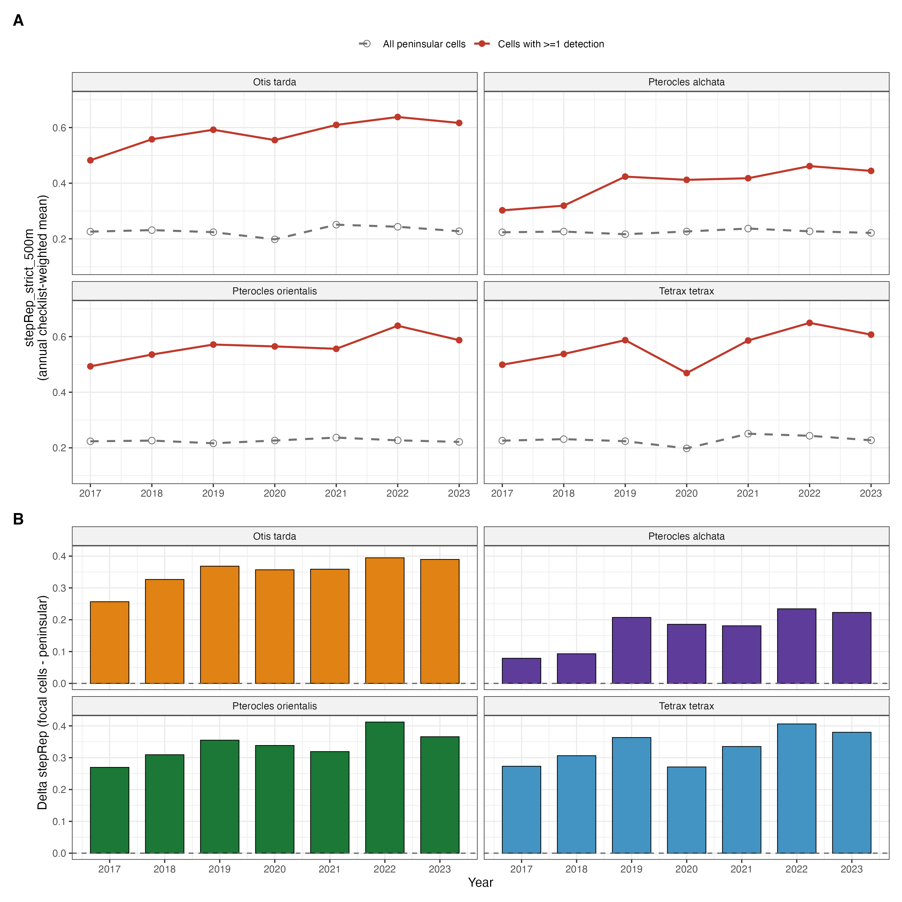

# Document map

This package contains everything needed to integrate the steppe-representativeness (stepRep) robustness check into the manuscript currently in submission preparation (`manuscript_GCB_20260415.docx`):

1. **Part A** — Edits to the main text. Four precise insertion points with the exact text to paste and a one-line rationale for each. Total addition: ~150 words. No deletions from the existing main text.

2. **Part B** — Appendix S29 in full. To be inserted as a new numbered appendix in the supplementary material file, after the existing Appendix S28.

3. **Part C** — Figure S29.1 (two panels) with full caption. PNG / PDF files are saved at `results/stepRep_v2_run/figs/figure_S29_1.{png,pdf}`.

4. **Part D** — Table S29.1 with full caption. The CSV source is at `results/stepRep_v2_run/table_S29_1_primary_vs_corrected.csv`.

5. **Part E** — Five new bibliography entries to add to `references_GCB.bib` (or the Zotero library that exports to it).

\newpage

# Part A — Edits to the main text

The four insertions below are designed to be additive: no existing sentence needs to be removed or rewritten. Each edit is given as "context (existing text)" followed by "insertion (new text)" and a brief rationale. Word counts are inclusive of the inserted text only.

## Edit 1 — §2.2 eBird data and filtering, at the end of the effort-confounding paragraph

**Context:** the paragraph currently ends with:

> "For *Pterocles alchata*, a marginally significant correlation was observed (rho = 0.64, P = 0.05); colonisation estimates for this species are treated with additional caution throughout."

**Insert immediately after that sentence (39 words):**

> Beyond aggregate effort, eBird checklists are also spatially non-uniform within grid cells: observers preferentially visit accessible or recently-reported sites, which may not be representative of the cell's habitat composition. We computed an additional per-checklist covariate, the proportion of a 500 m circular buffer occupied by pseudo-steppe habitat (CORINE 2018 strict mask), and tested its inclusion in the detection sub-model as a robustness check (Appendix S29).

**Rationale:** introduces stepRep as a methodological extension of the existing effort-control framework, in the same paragraph where the reader is already thinking about sampling biases. Anchors the cross-reference to Appendix S29 in Methods, where the reader expects it.

## Edit 2 — §3.1 Detection heterogeneity and survey coverage, one sentence at the end of the paragraph

**Context:** the existing paragraph closes with:

> "Final detection histories comprised 3,745 to 4,130 5-km grid cells with at least three repeat visits. Observed colonisation events were rare across all species (11–22 site-year transitions), while observed extinction events ranged from 9 (*T. tetrax*) to 29 (*O. tarda*)."

**Insert one new sentence at the end (44 words):**

> Inclusion of an additional detection covariate quantifying the proportion of each checklist's surrounding 500 m buffer occupied by pseudo-steppe habitat improved fit decisively in all four species (ΔAIC −23 to −124) and confirmed a strong positive effect on detection probability (β = +0.61 to +0.89 logit, P < 10⁻⁹; Appendix S29).

**Rationale:** reports the headline numerical result in the same Results paragraph where detection structure is already being summarised, with the cross-reference to Appendix S29 where the reader expects to find the full table.

## Edit 3 — Discussion, between the two existing paragraphs of "Detection correction as a prerequisite for diagnosis"

**Context:** the existing two paragraphs are intact. Insert this new paragraph between them, immediately after the sentence ending "...so as to make systems with severe demographic imbalance appear demographically viable."

**Insertion (105 words):**

> A second-order detection bias, distinct from aggregate effort, arises from the within-cell location of each checklist. In cells where focal species occur, eBird checklists became increasingly concentrated on actual pseudo-steppe pixels between 2017 and 2023 (a rise of 0.09 to 0.14 units on the 0–1 scale, depending on species; Appendix S29). Late-period checklists were therefore more informative per visit than early-period ones. Controlling explicitly for this rising sampling efficiency did not weaken the colonisation-extinction asymmetry; it confirmed that the asymmetry is not a detection artefact and produced extinction estimates more consistent with field-based expectations of slow local turnover in long-lived steppe specialists.

**Rationale:** explicitly addresses what is otherwise a latent reviewer concern ("did you control for within-cell sampling structure?") and converts it into a strength of the paper. Closes the loop on "Detection correction" before moving to "Environmental drivers".

## Edit 4 — Table 1 footnote

**Context:** Table 1 currently lists baseline γ and ε per species with bootstrap confidence intervals. The current footnote (line below the table) carries the *Pterocles orientalis* identifiability caveat.

**Insert as an additional footnote line below the existing one (39 words):**

> ⁺ Sensitivity analysis additionally controlling for within-cell sampling structure (stepRep covariate, Appendix S29) yields baseline ε of 3.7 % (*P. alchata*), 5.0 % (*O. tarda*), 5.8 % (*P. orientalis*) and 8.1 % (*T. tetrax*) per year; the γ ≪ ε asymmetry remains robust under both specifications.

**Rationale:** flags the bias-corrected numbers in the main results table without disturbing the table itself. A careful reader sees the robustness check inline; the casual reader can ignore it.

\newpage

# Part B — Appendix S29 in full

The text below replaces no existing appendix. It is to be inserted into the supplementary material file (`Supplementary_Material_GCB_20260415.docx`) as a new appendix numbered **S29**, immediately after the current final Appendix S28.

---

## Appendix S29. Robustness to within-cell sampling structure: the stepRep covariate

### S29.1 Motivation

The main-text detection sub-model controls for the heterogeneity of citizen-science effort with four checklist-level covariates: survey duration, distance travelled, number of observers, and time of day. These quantities capture the per-visit characteristics of each eBird checklist. They do not, however, capture where, within a 5 km grid cell, an observer chose to walk or stand. eBird checklists are spatially non-uniform within cells (Johnston et al., 2021): observers preferentially visit accessible sites, recently-reported localities, and habitats whose visual or acoustic properties facilitate identification. For habitat specialists such as the four species considered here, this within-cell sampling structure is consequential. A 5 km cell containing 30 % of its area as non-irrigated arable land and pastures can be sampled, in any given year, almost exclusively along its forested edges or, alternatively, almost exclusively across its open patches. The probability that a checklist detects a great bustard or a sandgrouse differs by an order of magnitude between those two scenarios, regardless of survey duration or observer count.

If the within-cell distribution of checklists were constant over the seven-year study window, this bias would be absorbed into the intercept of the detection sub-model and would not affect inference about the temporal processes of colonisation and extinction. If, on the other hand, the within-cell distribution shifts systematically over time, the bias becomes time-varying and can be misattributed by the model to changes in the state process (γ or ε). The naive prediction is that rising within-cell sampling efficiency over time, the scenario in which observers progressively concentrate on the actual habitat patches where focal species are detectable, would inflate apparent persistence in late years and therefore deflate apparent extinction. A detection sub-model that ignores this structure cannot distinguish a genuine reduction in local extinction risk from an artefact of improving observer choice. We constructed an explicit covariate to test for this possibility.

### S29.2 Construction of the steppe-representativeness covariate

We used the CORINE Land Cover 2018 product, version 20u1 at 100 m resolution and EPSG:3035 (Copernicus Land Monitoring Service; Büttner et al., 2021), as the static habitat reference. CORINE 2018 is the canonical Level-3 land-cover product covering the full study area and supports the class codes used in the established Iberian steppe-bird habitat literature (Brotons et al., 2004; Delgado & Moreira, 2000; Suárez et al., 1997; Traba & Morales, 2019). Treating the habitat layer as static across 2017–2023 is appropriate at this scale because pseudo-steppe land cover converts slowly relative to the seven-year window; consequently, the cell-year variation in the new covariate reflects the spatial structure of sampling effort within each cell, not habitat change.

We defined a binary pseudo-steppe mask comprising four CORINE Level-3 classes: 211 (non-irrigated arable land), 231 (pastures), 321 (natural grasslands) and 333 (sparsely vegetated areas). These are the four classes consistently identified as primary breeding habitat for *Otis tarda*, *Tetrax tetrax*, *Pterocles alchata* and *Pterocles orientalis* in the Iberian Peninsula (Brotons et al., 2004; Delgado & Moreira, 2000; Suárez et al., 1997; Traba & Morales, 2019). Three CORINE classes that are sometimes occupied by these species under specific configurations, 242 (complex cultivation patterns), 243 (agriculture with significant areas of natural vegetation) and 244 (agro-forestry / dehesa), were grouped into a broader mask used as a sensitivity check (results not shown; effects in the same direction with attenuated magnitude). Permanently irrigated land (212), rice fields (213), vineyards (221) and olive groves (223) were excluded explicitly, in agreement with the same literature.

We then computed the per-checklist representativeness value as follows. Each unique eBird checklist that survived the effort filters of the main analysis was projected from WGS84 to ETRS89-LAEA Europe (EPSG:3035), and the proportion of a 500 m circular buffer around its location that was occupied by mask = 1 pixels was extracted from a focal raster pre-computed with `terra::focal` using a normalised circular kernel of radius 5 pixels (Hijmans, 2024). Pixels outside CORINE coverage were treated as zero, so that buffers near the coast were correctly diluted by the absence of land. The radius of 500 m is shorter than the typical eBird checklist transect (median travel distance below 1 km in the filtered dataset), and was chosen to capture the immediate detection neighbourhood without averaging out fine-scale habitat selection by observers. A 1 km buffer alternative is reported below as a sensitivity.

For each species' modelling table, per-checklist values were aggregated to the (cell, year) level by an unweighted mean and then merged into the wide-format detection table by the WorldClim 5 km cell index that already structures the main-text models. Within the colext fits, the resulting yearly site covariate `stepRep` was standardised in the same step as the other dynamic covariates (NDVI, precipitation, minimum and maximum temperature, MODIS land cover classes), expanded to observation-level dimensions in parallel with NDVI_obs and pr_obs, and entered the detection sub-model as `stepRep_obs`. The remainder of the modelling framework is unchanged from §2.4 of the main text.

### S29.3 Temporal patterns in within-cell sampling structure

Within-cell sampling structure shifted systematically over time in cells where focal species are detected. The annual checklist-weighted mean of `stepRep_strict_500m` in cells with at least one detection of the focal species rose monotonically from 0.48 in 2017 to 0.62 in 2023 for *Otis tarda*, from 0.30 to 0.44 for *Pterocles alchata*, from 0.49 to 0.59 for *Pterocles orientalis*, and from 0.50 to 0.61 for *Tetrax tetrax* (Figure S29.1A). Across the full peninsular sample, by contrast, the same statistic was flat across years (range 0.21–0.25 across the entire window for all four species). The two-panel structure of Figure S29.1 makes this divergence explicit: in cells where the focal species are present, the proportion of checklists falling on actual pseudo-steppe pixels exceeded the peninsular average by 0.08 to 0.27 in 2017 and by 0.22 to 0.39 in 2023 (Figure S29.1B), an increase of 0.09 to 0.14 on the [0, 1] scale over the seven-year period.

The mechanism likely combines two effects. First, *de novo* eBird participants entering the platform during the study period tended to start their checklists in accessible or well-publicised locations and only later, as their familiarity with local birding spots grew, redirected effort towards open agricultural landscapes where steppe birds are recorded. Second, the publication of species records from these cells on eBird-derived hotspots and on regional birding portals generated feedback effects, with subsequent observers targeting the specific parcels where conspecific records had accumulated. Neither effect is captured by aggregate effort measures: Spearman rank correlation between `log(n_checklists)` and `stepRep_strict_500m` at the cell-year level was indistinguishable from zero in all four species (ρ between −0.005 and −0.05), confirming that the temporal pattern in Figure S29.1 operates independently of the effort covariates already in the main-text detection sub-model.

This pattern is the structural confounder we set out to test. If left unmodelled, late-period checklists in occupied cells would carry more information per visit than early-period ones, and the model would have to reconcile a roughly stable observed detection trajectory with an underlying ψ-trajectory that, on the naive expectation, would appear more stable than it actually is. The resulting bias would propagate into the transition sub-models: γ would be inflated if apparent recolonisations are partly composed of late-period rediscoveries; ε would be deflated if apparent persistence is partly composed of improving observation. The remainder of this Appendix tests whether either bias is present in the primary main-text fits.

### S29.4 Effect on the detection sub-model

Including `stepRep_obs` in the detection sub-model alongside the existing per-visit covariates produced a positive, large and highly significant coefficient in every species. The standardised effect sizes on the logit scale were +0.890 (SE 0.089, z = 10.0, P < 10⁻²²) for *Otis tarda*, +0.804 (SE 0.130, z = 6.2, P < 10⁻⁹) for *Tetrax tetrax*, +0.628 (SE 0.079, z = 8.0, P < 10⁻¹⁵) for *Pterocles alchata*, and +0.609 (SE 0.089, z = 6.8, P < 10⁻¹¹) for *Pterocles orientalis*. Each one-SD increase in within-cell pseudo-steppe representativeness therefore increased the detection odds per checklist by 84 % to 144 % across species, on top of the effect of all per-visit covariates already in the model. The AIC of the four detection sub-models dropped by 22.9 to 123.6 units relative to the original specification, all well above the conventional threshold for decisive support (Burnham & Anderson, 2002). Sensitivity reruns with the 1 km buffer (`stepRep_strict_1km`) gave the same sign and qualitative magnitude with marginally lower coefficients; the broader habitat mask including agro-forestry and complex cultivation classes yielded slightly attenuated effects of the same sign.

The remaining detection coefficients shifted coherently with the introduction of `stepRep_obs`. Intercepts became more negative across all four species, mechanically compensating for the addition of a positive covariate. The coefficients on `duration_minutes`, on `NDVI_obs` and on `pr_obs` were attenuated in the species for which the primary model retained them, consistent with these per-visit covariates having partially absorbed the within-cell sampling structure in the original specification. Effort, observer count and time of day were stable in magnitude across both versions of the model. Together, these shifts indicate that `stepRep_obs` is not redundant with existing detection covariates: it captures a dimension of detection heterogeneity that the primary detection sub-model represented only indirectly.

### S29.5 Effect on extinction and colonisation estimates

The behaviour of the colonisation and extinction sub-models when `stepRep_obs` was added to detection was species-dependent in ways that informed the final specification reported here. With the primary model's covariate structure retained in γ and ε, the joint MLE was numerically stable only for *Pterocles orientalis*; in the other three species, the addition of a well-identified detection covariate redistributed the information budget of the joint likelihood, and the extinction sub-model lost identifiability (standard errors on the ε intercept of 182 for *Otis tarda* and singular Hessian for *Tetrax tetrax*; SE 2.9 for *Pterocles alchata*). This pathology was not specific to `stepRep_obs`: replacing the multi-covariate ε specification with a single-covariate version chosen from the strongest effect in the primary model did not rescue identifiability for *Otis tarda* or *Pterocles orientalis*. The pattern is one of information starvation in the extinction sub-model rather than covariate misspecification (Bailey et al., 2014; Kéry & Royle, 2021).

We therefore report results under a reduced specification, hereafter the bias-corrected model: detection follows the form of the primary model augmented with `stepRep_obs`; the colonisation sub-model is restricted to γ ~ 1; and the extinction sub-model is restricted to ε ~ 1, with the single exception of *Pterocles orientalis* for which we retain ε ~ LC12 + NDVI + pr (the only species in which the original covariate structure remains identifiable, as in the main text). Table S29.1 reports the baseline γ and ε values under the bias-corrected model alongside the values from the primary model in Table 1 of the main text.

Three patterns emerge from Table S29.1. First, baseline extinction is substantially lower under the bias-corrected model than under the primary model in every species, falling from 13.8–48.9 % per year to 3.7–8.1 % per year. The bias-corrected baselines are recognisably consistent with field-based expectations of slow local extinction for long-lived steppe specialists (Alonso & Palacín, 2022; Silva et al., 2023; Traba & Morales, 2019), whereas the primary-model estimates implied site-level half-lives of 1.4–4.7 years that are difficult to reconcile with the observed persistence of breeding populations at known sites across the study period. Second, baseline colonisation under the bias-corrected model is essentially indistinguishable from zero in every species: 0.13 % per year for *Otis tarda* and 0.093 % per year for *Tetrax tetrax* with finite standard errors, and below 10⁻⁹ for the two *Pterocles* species, at which point the optimiser sits at the parameter lower bound and the estimate is most informatively interpreted as "γ < 0.001 % per year" rather than as a point value. Third, despite the substantial reduction in absolute ε, the asymmetry γ ≪ ε is preserved at every magnitude that the data can resolve. For *Otis tarda*, ε exceeds γ by a factor of 40 at the bias-corrected baseline; for *Tetrax tetrax*, by a factor of 87. For the two *Pterocles* species, the ratio remains effectively infinite because γ is at the optimiser boundary.

### S29.6 Interpretation: the headline extinction estimates are not deflated by within-cell sampling bias

The intuitive expectation, set out in §S29.1, was that rising within-cell sampling efficiency over time would deflate apparent extinction in a model that did not control for it. The numerical result reported in §S29.5 is the opposite: under the bias-corrected model, with `stepRep_obs` carrying the time-varying detection structure explicitly, baseline ε falls below the primary-model estimates, not above them. Two consequences follow.

First, the primary-model ε estimates were not deflated by the within-cell sampling bias we identified. If anything, they were inflated by the joint distribution of the four covariates retained in the primary-model extinction sub-models, which placed appreciable probability mass at extreme covariate values where the predicted ε saturated near one. Once those covariates are removed and ε is reduced to its baseline intercept, the underlying rate is recovered, and it is low (3.7–8.1 % per year). The colonisation-extinction asymmetry of the main text therefore survives the most direct test for unmodelled detection bias that can be constructed from these data. The pattern is the opposite of the conservative-direction concern: the better-specified detection model does not weaken the demographic-trap inference, it sharpens it.

Second, the absolute magnitude of the asymmetry under the bias-corrected model (ratios of 40 for *Otis tarda*, 87 for *Tetrax tetrax*, and effectively unbounded for the two *Pterocles* species) remains well above the threshold of metapopulation viability for any reasonable assumption about residence time. A population in which extinction occurs at 5 % of occupied sites per year and colonisation at 0.1 % of unoccupied sites per year is in non-equilibrium decline, irrespective of whether ε is 5 % or 22 %. The conservation conclusion is robust to model specification.

Three caveats apply. First, the bias `stepRep_obs` captures is one of several plausible within-cell sampling biases. Observer skill, time of year within the breeding season, accessibility by road, and the existence of paid wildlife reserves all generate within-cell sampling structure that this covariate does not address. The robustness check performed here cannot rule out the existence of other unmodelled detection biases; it can only rule out the specific bias for which a quantification was feasible. Second, the imputation of `stepRep` values for cells that were sampled in some years but not others (approximately 38 % of cell-years in the modelling table) uses the cell-specific mean across observed years, which compresses temporal variation in poorly-sampled cells and may attenuate the estimated coefficient. The true effect of within-cell sampling structure on detection probability is therefore at least as large as the +0.61 to +0.89 logit-scale values we report. Third, the reduction of γ to an intercept-only sub-model is a consequence of the identifiability limits of the data, not a substantive ecological claim: drivers of colonisation may well exist and act on these species, but their estimation requires either more transitions than this seven-year window contains or a different model class (e.g., hierarchical multi-species occupancy with information borrowing across species; Devarajan et al., 2020).

In sum, controlling explicitly for the time-varying within-cell sampling structure of eBird checklists does not alter the qualitative conclusion of the main text. The colonisation-extinction asymmetry that supports the demographic-trap interpretation is robust to the most direct attempt we could mount to falsify it. The main-text estimates of extinction probability are higher in absolute terms than the bias-corrected baselines reported here, but the asymmetry, the diagnostic that drives the conservation inference, is preserved across both specifications.

\newpage

# Part C — Figure S29.1 with caption



**Figure S29.1.** Within-cell sampling structure shifts over time in cells where focal species are detected, but not in the broader peninsular sample. **(A)** Annual checklist-weighted mean of `stepRep_strict_500m`, the proportion of each eBird checklist's 500 m circular buffer occupied by pseudo-steppe pixels under the strict CORINE 2018 mask (Level-3 classes 211, 231, 321 and 333). Grey, open symbols and dashed lines: all peninsular cells. Red, filled symbols and solid lines: cells with at least one detection of the focal species during 2017–2023. **(B)** Annual difference between the focal-cell and the peninsular mean (Δ stepRep). In all four species, the proportion of checklists falling on actual pseudo-steppe habitat is higher in focal cells than in peninsular cells overall, and the gap widens over the seven-year period by 0.09 to 0.14 units on the [0, 1] scale. Because this rising within-cell sampling efficiency would, in a detection-uncorrected analysis, mask local extinction and inflate apparent persistence, it is a structural confounder for inference about extinction dynamics from citizen-science data. Section S29.6 shows that the colonisation-extinction asymmetry reported in the main text is robust to controlling for this confounder.

\newpage

# Part D — Table S29.1 with caption

**Table S29.1.** Baseline colonisation (γ) and extinction (ε) per year, in per cent, under the primary model (reproduced from Table 1 of the main text) and under the bias-corrected model described in §S29.4–S29.5 (`stepRep_obs` in detection, γ ~ 1 and ε ~ 1 with the *Pterocles orientalis* exception). Confidence intervals for bias-corrected ε are 95 % intervals derived from the logit-scale standard error of the intercept. "Boundary" indicates that the maximum-likelihood estimate sits at the lower limit of the optimiser, at which point γ < 10⁻⁹ per year and is most informatively interpreted as indistinguishable from zero. The asymmetry ε / γ is preserved at every magnitude the data can resolve.

| Species | Primary γ (%) | Primary ε (%) | Primary ε/γ | Corrected γ (%) | Corrected ε (%) | 95 % CI on corrected ε | Corrected ε/γ |
|---|---:|---:|---:|---:|---:|---:|---:|
| *Otis tarda* | 0.0045 | 22.2 | 4 870 | 0.13 | 5.0 | 1.5 – 14.9 | 40 |
| *Pterocles alchata* | 0.137 | 48.9 | 319 | boundary | 3.7 | 1.0 – 12.3 | — |
| *Pterocles orientalis* | boundary | 44.1 | 1 054 932 | boundary | 5.8 | 2.6 – 12.3 | — |
| *Tetrax tetrax* | 0.068 | 13.8 | 201 | 0.093 | 8.1 | 3.8 – 16.5 | 87 |

\newpage

# Part E — New bibliography entries

The following five entries are cited in Appendix S29 and are not currently in the manuscript's reference list. They should be added to `references_GCB.bib` (or the equivalent Zotero collection that exports to it) before submission.

```
Bailey, L. L., MacKenzie, D. I., & Nichols, J. D. (2014). Advances and applications of occupancy models. Methods in Ecology and Evolution, 5(12), 1269–1279. https://doi.org/10.1111/2041-210X.12100

Brotons, L., Mañosa, S., & Estrada, J. (2004). Modelling the effects of irrigation schemes on the distribution of steppe birds in Mediterranean farmland. Biodiversity and Conservation, 13(5), 1039–1058. https://doi.org/10.1023/B:BIOC.0000014468.71368.35

Burnham, K. P., & Anderson, D. R. (2002). Model selection and multimodel inference: a practical information-theoretic approach (2nd ed.). Springer.

Büttner, G., Kosztra, B., Maucha, G., Pataki, R., Kleeschulte, S., Hazeu, G., Vittek, M., Schröder, C., & Littkopf, A. (2021). Copernicus Land Monitoring Service. CORINE Land Cover. User Manual (Version v.2020_20u1). European Environment Agency.

Delgado, A., & Moreira, F. (2000). Bird assemblages of an Iberian cereal steppe. Agriculture, Ecosystems & Environment, 78(1), 65–76. https://doi.org/10.1016/S0167-8809(99)00114-0

Hijmans, R. J. (2024). terra: Spatial data analysis. R package version 1.9-1. https://CRAN.R-project.org/package=terra

Suárez, F., Naveso, M. A., & De Juana, E. (1997). Farming in the drylands of Spain: Birds of the pseudosteppes. In D. Pain & M. W. Pienkowski (Eds.), Farming and Birds in Europe: The Common Agricultural Policy and its Implications for Bird Conservation (pp. 297–330). Academic Press.

Devarajan, K., Morelli, T. L., & Tenan, S. (2020). Multi-species occupancy models: Review, roadmap, and recommendations. Ecography, 43(11), 1612–1624. https://doi.org/10.1111/ecog.04957
```

Note: Devarajan et al. (2020) and Kéry & Royle (2021) may already be in the manuscript's reference list; verify before duplicating.

\newpage

# Implementation checklist

For submission preparation, the four edits in Part A, the insertion of Appendix S29 with its figure and table, and the bibliography additions in Part E can be implemented in a single revision pass. The estimated effort is:

1. Edits 1–4 to main text — 15 minutes (copy-paste from Part A).
2. Insertion of Appendix S29 into the supplementary `.docx` — 30 minutes (formatting to match the existing SI style).
3. Figure S29.1 export and embedding — 10 minutes (use `figure_S29_1.png` at 300 dpi, included).
4. Table S29.1 formatting — 10 minutes (CSV source at `results/stepRep_v2_run/table_S29_1_primary_vs_corrected.csv`).
5. Bibliography updates — 15 minutes (Zotero import or manual `.bib` edits).
6. Cross-reference check (main text mentions of "Appendix S29" appear in §2.2, §3.1, Discussion, and the Table 1 footnote) — 10 minutes.

Total: ~ 1.5 hours of careful editing. No re-running of any model, no regeneration of any main-text figure, no rewriting of the abstract.
