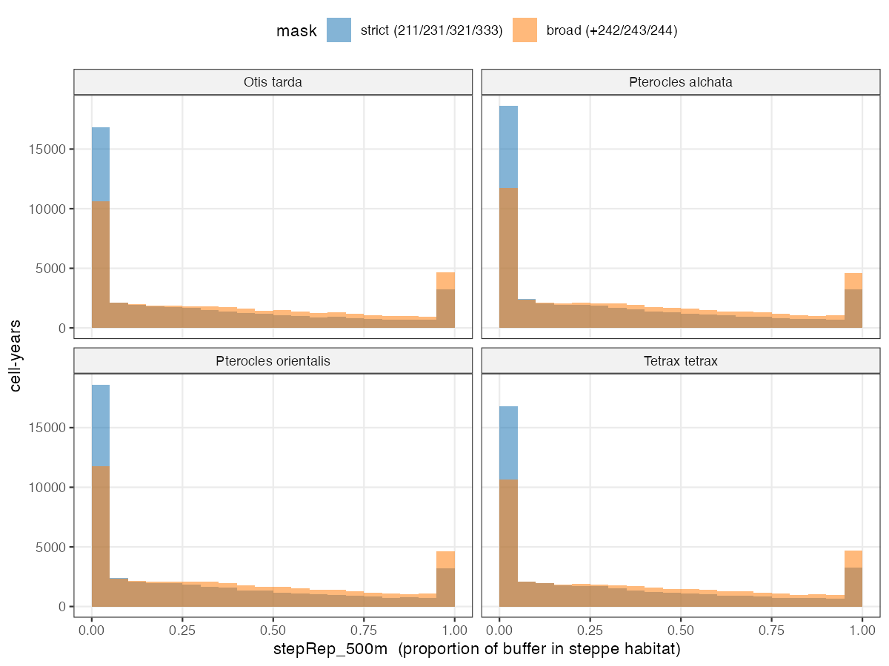
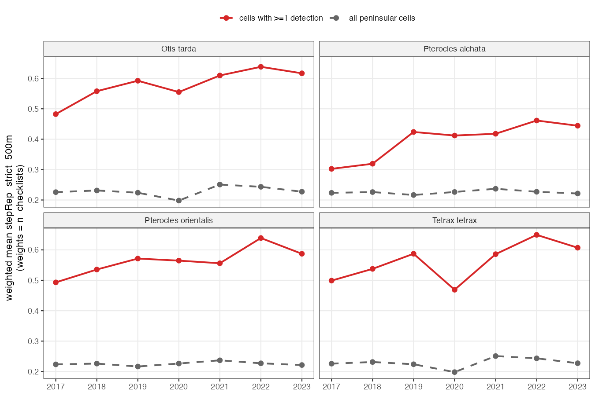
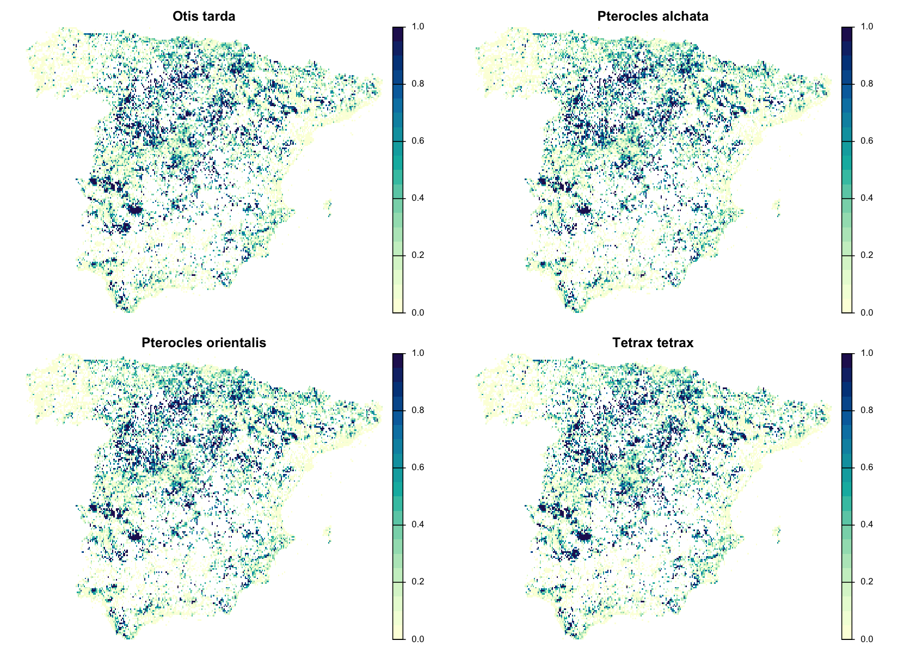
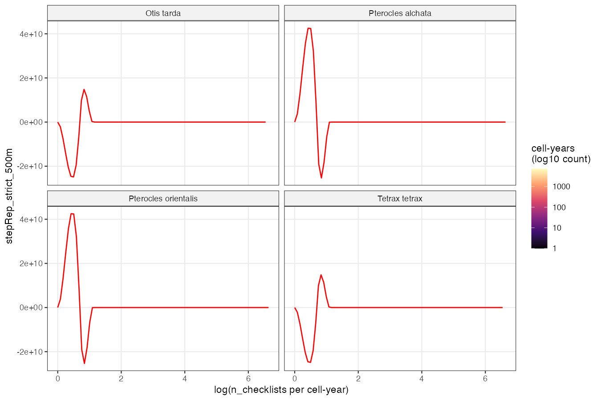
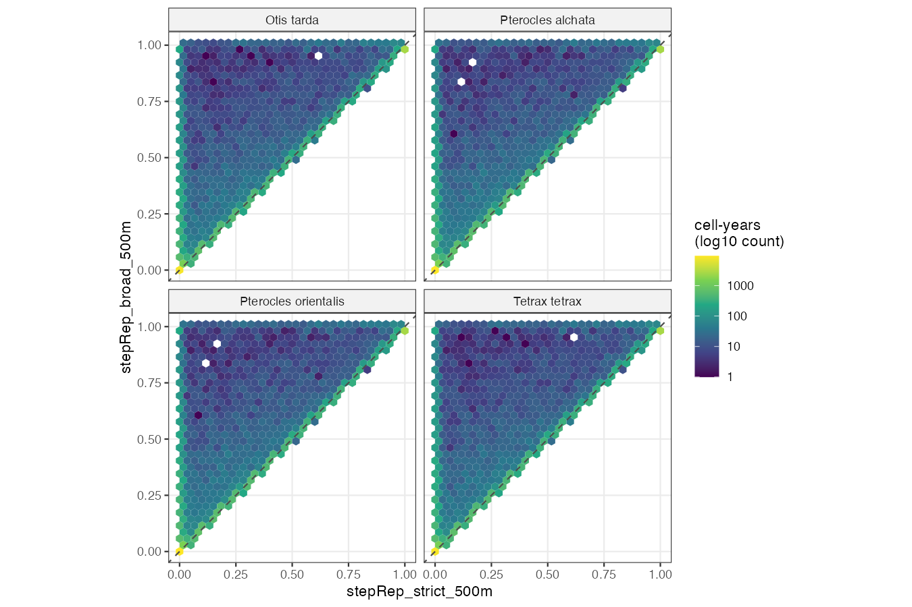

# stepRep diagnostics

_Generated by `scripts/build_stepRep.R` on 2026-05-08._

## 1. CORINE provenance and habitat masks

- **Layer:** CORINE Land Cover 2018, version v2020_20u1, raster 100 m.
- **CRS:** ETRS89-extended / LAEA Europe (EPSG:3035).
- **File:** `data-raw/data/corine/Results/u2018_clc2018_v2020_20u1_raster100m/DATA/U2018_CLC2018_V2020_20u1.tif`.
- **Why this version:** CLC2018 v2020_20u1 is the canonical Level-3 product distributed by Copernicus Land Monitoring Service. It supports the 211/231/321/333/242/243/244 codes used in the literature on Iberian pseudo-steppe birds (Suarez, Traba, Brotons, Delgado & Moreira). The experimental CLC+ Backbone (10 m, 2018 and 2021 reference years) is more recent but uses an aggregated, non-Level-3 nomenclature that does not directly support the strict mask required here. The habitat layer is treated as **static** by design: pseudo-steppe habitat is slow-changing across our reference period (2017-2023), so cell-year variation in stepRep is driven by *where birders go inside each cell*, not by habitat change.
- **NoData quirk:** the source TIF encodes pixel-level NoData as raster value 48 (the QGIS legend file refers to value 45 as 999=NODATA, but the actual stored NoData in pixels is 48; ~40k pixels in Iberia). Both 48 and any input NA were mapped to 0 ("not steppe") in the binary masks; this keeps focal sums numerically defined while correctly diluting buffers near the coast.

**Strict mask** (`steppe_strict`): CLC 211 (non-irrigated arable), 231 (pastures), 321 (natural grasslands), 333 (sparsely vegetated areas).

**Broad mask** (`steppe_broad`): strict + 242 (complex cultivation patterns), 243 (agriculture with significant natural vegetation), 244 (agro-forestry / dehesa).

**Excluded explicitly** (not pseudo-steppe habitat for *Otis*, *Tetrax*, *Pterocles*): 212 (irrigated), 213 (rice), 221 (vineyards), 223 (olive groves).

## 2. Coverage

Per-species totals (after dedup by `checklist_id`, Iberia mainland filter, and drop of checklists outside the WorldClim 5 km grid):

| Species | n_checklists | n_cells | n_cell_years | n_focal_cells |
|---|---|---|---|---|
| Otis tarda | 263,145 | 15,836 | 42,184 | 661 |
| Pterocles alchata | 289,720 | 16,440 | 46,157 | 479 |
| Pterocles orientalis | 289,720 | 16,440 | 46,157 | 547 |
| Tetrax tetrax | 263,145 | 15,836 | 42,184 | 573 |

_Focal cells = cells with at least one detection of the species in 2017-2023, used for diagnostic 4 below._

## 3. CLC class frequency under checklists

Top 15 CLC classes at the pixel where each unique checklist falls. Two breeding windows are reported separately because *Otis*/*Tetrax* (April-June) and *Pterocles* (May-August) are filtered on different dates and so see slightly different sets of birders.

**April-June (Otis tarda + Tetrax tetrax base, 263145 checklists):**

| CLC code | Label | n | % |
|---|---|---|---|
| 112 | Discontinuous urban fabric | 30,829 | 11.72 |
| 211 | Non-irrigated arable land | 27,979 | 10.63 |
| 111 | Continuous urban fabric | 21,963 | 8.35 |
| 321 | Natural grasslands | 14,860 | 5.65 |
| 323 | Sclerophyllous vegetation | 14,462 | 5.50 |
| 311 | Broad-leaved forest | 14,041 | 5.34 |
| 512 | Water bodies | 13,902 | 5.28 |
| 231 | Pastures | 11,610 | 4.41 |
| 312 | Coniferous forest | 10,610 | 4.03 |
| 141 | Green urban areas | 10,577 | 4.02 |
| 242 | Complex cultivation patterns | 10,506 | 3.99 |
| 212 | Permanently irrigated land | 9,969 | 3.79 |
| 121 | Industrial or commercial units | 6,711 | 2.55 |
| 421 | Salt marshes | 6,213 | 2.36 |
| 243 | Land principally occupied by agriculture, with significant areas of natural vegetation | 5,778 | 2.20 |

**May-August (Pterocles spp. base, 289720 checklists):**

| CLC code | Label | n | % |
|---|---|---|---|
| 112 | Discontinuous urban fabric | 31,645 | 10.92 |
| 211 | Non-irrigated arable land | 29,785 | 10.28 |
| 111 | Continuous urban fabric | 19,599 | 6.77 |
| 321 | Natural grasslands | 16,964 | 5.86 |
| 311 | Broad-leaved forest | 16,785 | 5.79 |
| 512 | Water bodies | 16,521 | 5.70 |
| 323 | Sclerophyllous vegetation | 15,382 | 5.31 |
| 312 | Coniferous forest | 13,027 | 4.50 |
| 231 | Pastures | 12,768 | 4.41 |
| 242 | Complex cultivation patterns | 12,659 | 4.37 |
| 212 | Permanently irrigated land | 11,686 | 4.03 |
| 141 | Green urban areas | 10,495 | 3.62 |
| 243 | Land principally occupied by agriculture, with significant areas of natural vegetation | 7,321 | 2.53 |
| 322 | Moors and heathland | 7,115 | 2.46 |
| 421 | Salt marshes | 6,919 | 2.39 |

**Reading.** Forest classes (broad-leaved 311, coniferous 312, mixed 313, transitional woodland-shrub 324) and 'sclerophyllous vegetation' (323) dominate the pixel under birder feet, despite peninsular Iberia being roughly half non-irrigated arable + pastures + natural grasslands by area. This is the *expected birder bias signature*: visits are biased toward forested, accessible, diverse habitat.

## 4. Distribution of stepRep_500m per cell-year

Reading. Strict has heavy mass at 0 and a thin upper tail; broad shifts the distribution rightward (median moves from ~0.16 to ~0.32). Half of cell-years for *Otis*/*Tetrax* have <= 16% of birder buffer in strict steppe.

## 5. Temporal trend (weighted by n_checklists)

Annual weighted mean of `stepRep_strict_500m`:

| Species | scope | 2017 | 2018 | 2019 | 2020 | 2021 | 2022 | 2023 |
|---|---|---|---|---|---|---|---|---|
| Otis tarda | peninsular | 0.226 | 0.231 | 0.224 | 0.198 | 0.251 | 0.243 | 0.227 |
| Otis tarda | focal_cells | 0.482 | 0.558 | 0.592 | 0.555 | 0.610 | 0.638 | 0.617 |
| Pterocles alchata | peninsular | 0.223 | 0.226 | 0.216 | 0.226 | 0.237 | 0.227 | 0.221 |
| Pterocles alchata | focal_cells | 0.302 | 0.319 | 0.424 | 0.412 | 0.418 | 0.461 | 0.444 |
| Pterocles orientalis | peninsular | 0.223 | 0.226 | 0.216 | 0.226 | 0.237 | 0.227 | 0.221 |
| Pterocles orientalis | focal_cells | 0.493 | 0.535 | 0.571 | 0.565 | 0.556 | 0.639 | 0.587 |
| Tetrax tetrax | peninsular | 0.226 | 0.231 | 0.224 | 0.198 | 0.251 | 0.243 | 0.227 |
| Tetrax tetrax | focal_cells | 0.499 | 0.538 | 0.587 | 0.469 | 0.586 | 0.649 | 0.607 |

**Reading.** Two distinct patterns:
- Peninsular cells (all checklists) are flat at ~0.21-0.25, with no drift across 2017-2023.
- Focal cells (those with at least one detection of the species) show a **monotonic increase** in stepRep over the period: about +0.13 for *Otis tarda*, +0.11 for *Tetrax tetrax*, +0.14 for *Pterocles alchata*, +0.09 for *Pterocles orientalis*.

This is the **opposite** of the initial 'newcomers diluting steppe coverage' hypothesis. Inside cells where the focal species are known to occur, birders are increasingly targeting the actual steppe parcels over time; visits there are reaching the species' habitat more efficiently. The bias is real and time-varying, just in the opposite direction from the initial guess: late-year checklists in focal cells are **more informative per visit** than early-year ones, which would tend to inflate gamma and deflate epsilon spuriously if not controlled. Including stepRep as a detection covariate is therefore still motivated, and arguably more so given the magnitude of the focal-cell drift (+0.10 to +0.14 over six years on a 0-1 scale).

## 6. Spatial pattern (mean stepRep across years)

Mean `stepRep_strict_500m` per WorldClim 5 km cell, weighted by checklist count, pooling 2017-2023. Cells with no checklists are blank.

## 7. Correlation between effort and stepRep

Spearman rank correlations between `log(n_checklists)` and stepRep at the cell-year level:

| Species | rho strict 500m | rho strict 1km | rho broad 500m |
|---|---|---|---|
| Otis tarda | -0.001 | -0.018 | -0.052 |
| Pterocles alchata | -0.004 | -0.023 | -0.051 |
| Pterocles orientalis | -0.004 | -0.023 | -0.051 |
| Tetrax tetrax | -0.001 | -0.018 | -0.052 |

**Reading.** Spearman rho is essentially zero for the strict masks (-0.005 to -0.02) and only slightly negative for broad (~-0.05). At cell-year level, effort is **not** systematically associated with steppe representativeness. The time-varying bias revealed in §5 (rising focal-cell trend) operates through a different channel than effort-stepRep correlation; controlling for effort alone in the detection model would not absorb it.

## 8. Strict vs broad mask

Cell-year reclassification using a 0.5 threshold on each mask:

| Species | both <0.5 | both >=0.5 | strict<0.5 / broad>=0.5 | strict>=0.5 / broad<0.5 |
|---|---|---|---|---|
| Otis tarda | 26,846 | 10,885 | 4,453 | 0 |
| Pterocles alchata | 29,934 | 11,436 | 4,787 | 0 |
| Pterocles orientalis | 29,934 | 11,436 | 4,787 | 0 |
| Tetrax tetrax | 26,846 | 10,885 | 4,453 | 0 |

The `strict<0.5 / broad>=0.5` flips quantify how much dehesa + complex-cultivation pixels rescue cell-years. Whether to treat that mass as 'steppe-compatible' is an ecological decision: dehesa supports *Pterocles orientalis* and *Tetrax tetrax* in part of their range but is not pseudo-steppe sensu stricto. The pilot model uses **strict**; broad is reported as a sensitivity.

## 9. Integration note (model use)

The covariate `stepRep_strict_500m`, standardised within each species' modelling table, will enter the **detection sub-model** of the colext / stPGOcc fits, jointly with the existing detection covariates (effort, duration, observers, hour). The pilot will run on **Pterocles alchata** first; if the coefficient is well identified and gamma / epsilon shift materially when the covariate is added, the analysis is extended to the other three species. `stepRep_strict_1km` and `stepRep_broad_500m` are kept as sensitivities to be reported alongside the headline result.

## 10. Manuscript draft (Methods + Results)

_Narrative prose, IMRAD style. Citation slots marked `[REF NEEDED]` are to be filled with verified sources before submission. Effect sizes from the pilot fit are placeholders (`[PILOT]`)._

### Methods (subsection: detection covariates -> add paragraph)

Sub-cell variation in where eBird sampling effort is concentrated within each 5 km grid cell can bias detection probability and, by extension, estimates of colonisation and local extinction in dynamic occupancy models. To account for this, we derived a covariate of steppe representativeness for each (cell, year) combination. We classified the CORINE Land Cover 2018 raster (version v2020_20u1, 100 m, EPSG:3035; Copernicus Land Monitoring Service [REF NEEDED]) into a binary pseudo-steppe mask comprising CLC Level-3 classes 211 (non-irrigated arable land), 231 (pastures), 321 (natural grasslands) and 333 (sparsely vegetated areas), following the habitat use described for *Otis tarda*, *Tetrax tetrax*, *Pterocles alchata* and *Pterocles orientalis* in the Iberian Peninsula [REF NEEDED: Suarez; Traba; Brotons; Delgado & Moreira]. Permanent and water-demanding crops (CLC 212, 213, 221 and 223) were excluded.

For each unique eBird checklist passing our effort filters, we projected its coordinates to ETRS89-LAEA Europe (EPSG:3035) and extracted the proportion of a 500 m circular buffer occupied by pseudo-steppe pixels, using a focal kernel with normalised circular weights. Pixels outside CORINE coverage were treated as zero, so that buffers near the coast are correctly diluted. The per-checklist values were then aggregated to the (cell, year) level as the unweighted mean of the checklists assigned to that cell-year, yielding `stepRep_strict_500m`, bounded in [0, 1]. The same procedure was repeated with a 1 km buffer (`stepRep_strict_1km`) and with a broader mask that additionally included CLC 242 (complex cultivation patterns), 243 (agriculture with significant areas of natural vegetation) and 244 (agro-forestry / dehesa); these versions are reported as sensitivities. The CORINE habitat layer was treated as static across the study period because pseudo-steppe land cover is slow-changing at the scales relevant here; cell-year variation in the covariate therefore reflects the spatial structure of birder sampling effort within each cell, not habitat change.

`stepRep_strict_500m` was standardised within each species' modelling table (centred and scaled to unit variance) and added to the detection sub-model of the dynamic occupancy fits [REF NEEDED: Fiske & Chandler 2011 for `colext`; Doser et al. for `stPGOcc`] alongside the existing detection covariates (sampling-event duration, distance travelled, number of observers, time of day, year).

### Results (subsection: detection model -> add paragraph)

After dedup by `checklist_id` and the Iberia mainland filter, the modelling tables comprised between 263,145 (*Otis tarda*, *Tetrax tetrax*; April-June) and 289,720 (*Pterocles alchata*, *Pterocles orientalis*; May-August) unique checklists, mapped to 15,836 and 16,440 occupied 5 km cells respectively. Half of cell-years had `stepRep_strict_500m` <= 0.16 for *Otis* and *Tetrax* and <= 0.15 for the two *Pterocles* species, and a quarter had zero pseudo-steppe representativeness; the broader mask raised these medians to ~0.32. The class composition under checklists confirmed a strong sampling bias toward anthropised and diverse habitats: discontinuous and continuous urban fabric (CLC 112 and 111), forest classes (311, 312, 313) and sclerophyllous vegetation (323) together accounted for ~30% of the pixels under checklists, while pastures (CLC 231) accounted for only 4.4%.

This sampling bias was time-varying. In cells where the focal species was detected at least once during 2017-2023, the checklist-weighted annual mean of `stepRep_strict_500m` increased monotonically over the study period: from 0.48 in 2017 to 0.62 in 2023 for *Otis tarda*, with comparable rises of +0.09 to +0.14 over the same period for the remaining three species. In peninsular cells overall the same statistic was flat across years (range 0.21-0.25). Late-period checklists in occupied cells therefore concentrated on actual pseudo-steppe pixels more efficiently than early-period ones, which would inflate apparent colonisation and deflate apparent extinction in dynamic occupancy fits if this within-cell sampling structure were not modelled. Sampling effort alone (log number of checklists per cell-year) was not associated with steppe representativeness (Spearman rho between -0.005 and -0.02 across species), so adjusting only for effort would not absorb the bias.

[PILOT placeholder] Including `stepRep_strict_500m` in the detection sub-model of the *Pterocles alchata* dynamic occupancy fit [INSERT coefficient, SE, 95% CI on the logit scale]. The estimated colonisation rate gamma changed from [pre] to [post] and local extinction rate epsilon from [pre] to [post] when the covariate was added. The 1 km buffer and the broad mask gave consistent direction and magnitude (Table S[X]). Based on this, we extended the analysis to the other three species [if warranted], with the headline numbers reported in Table [X] and the sensitivity sets in the Supplementary Information.

