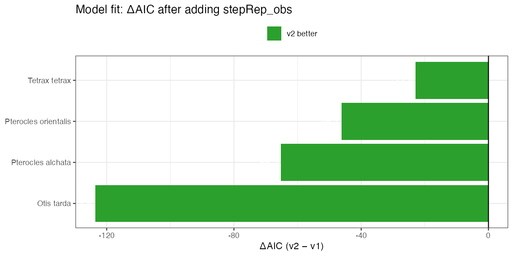
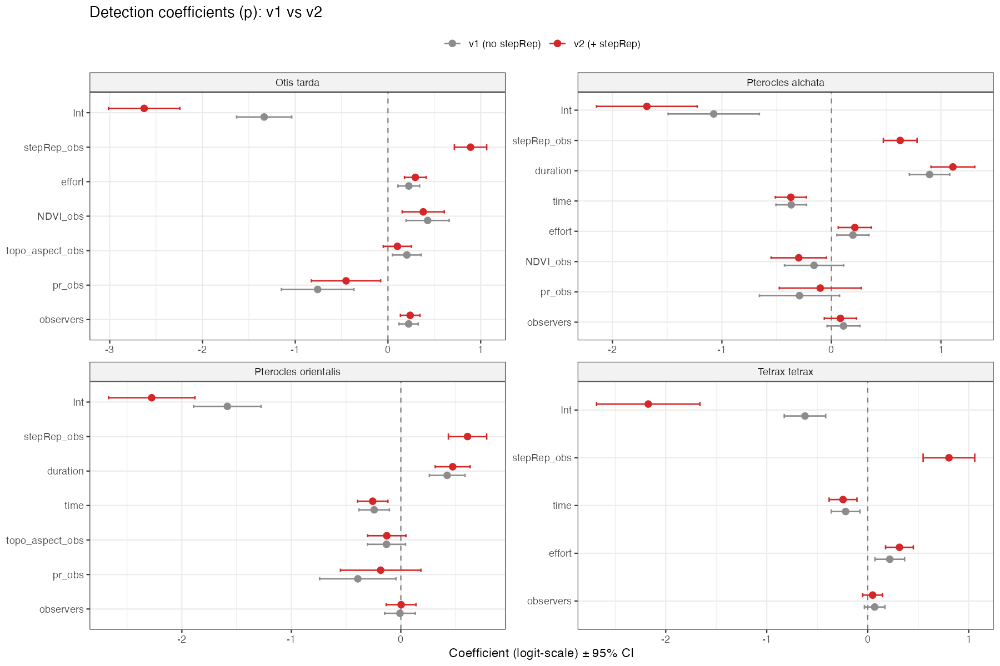
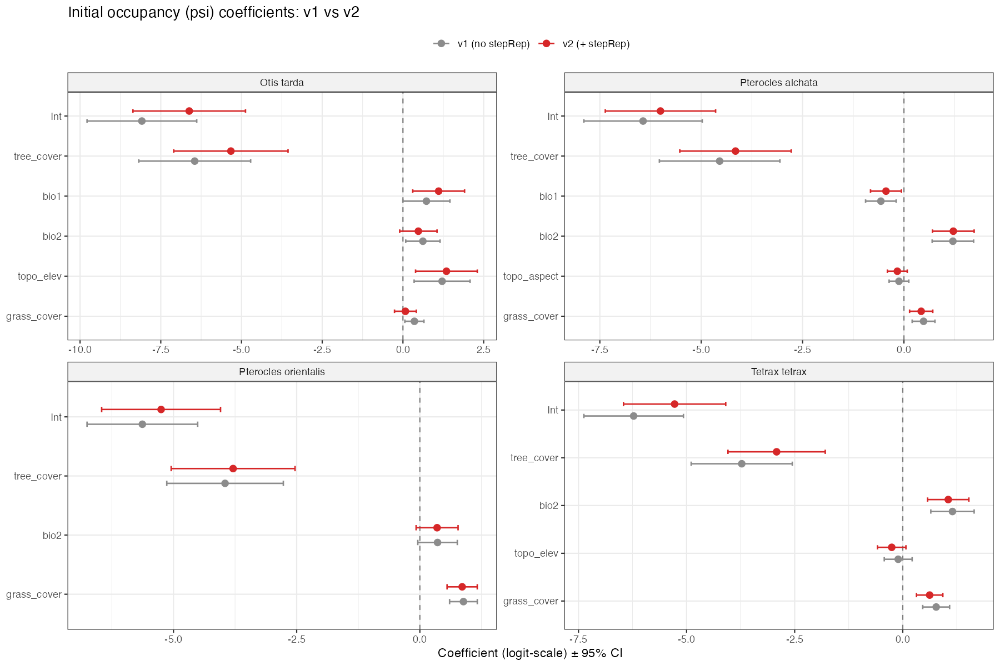
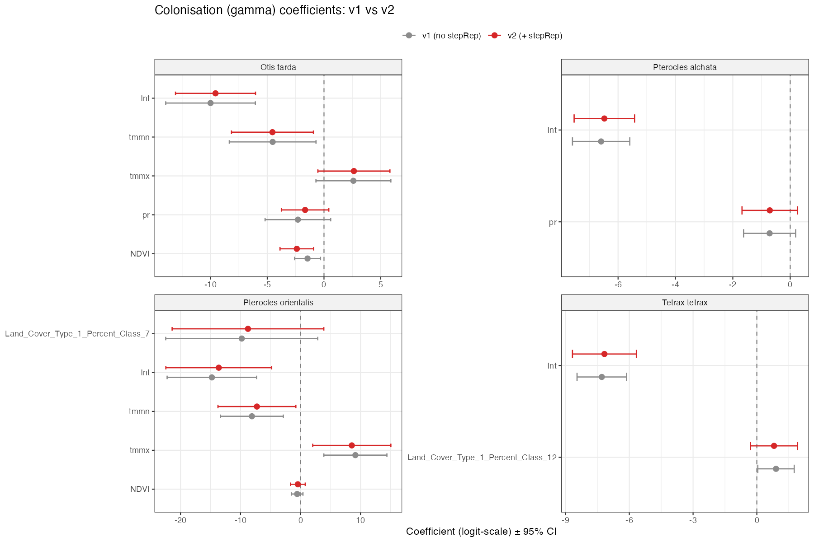
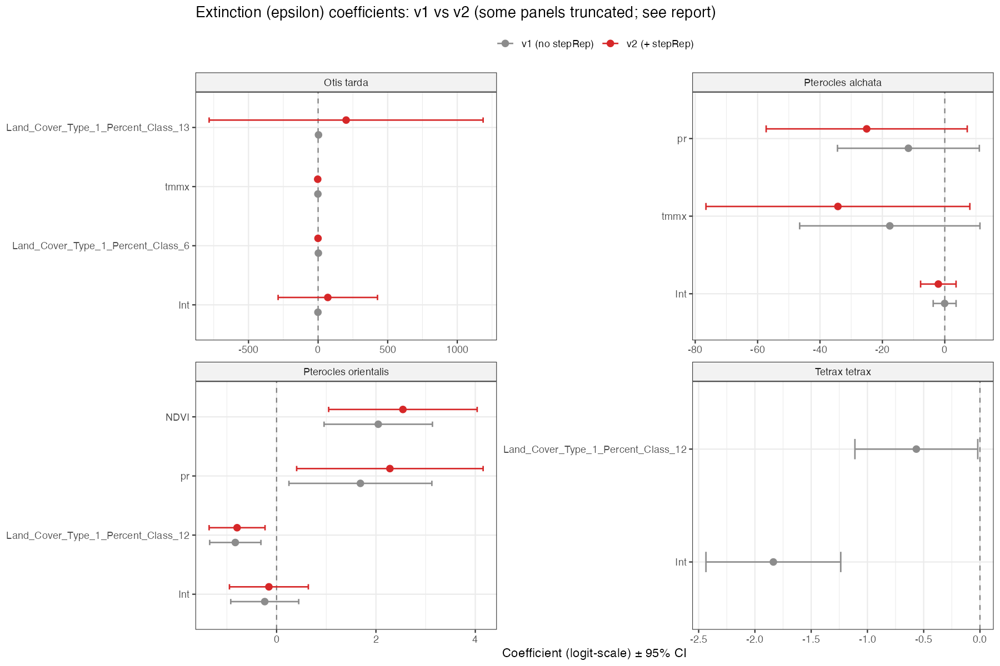

# Steppe-representativeness covariate (`stepRep`): rationale, implementation and v1 vs v2 model comparison

_Generated 2026-05-10 from the v1 fits (commits up to `6c5ffe7`) and the v2 fits (`Add 4_occupancy_models_v2.R drop-in script`, `a2ff874`, run with Raúl's filtered eBird CSVs)._

---

## 1. Executive summary

We added a new covariate, `stepRep`, to the **detection sub-model** of the dynamic occupancy fits (`unmarked::colext`) for the four steppe birds *Otis tarda*, *Tetrax tetrax*, *Pterocles alchata* and *Pterocles orientalis*. `stepRep` quantifies, for each (cell, year) combination, the fraction of eBird checklists in that cell-year whose location falls on pseudo-steppe habitat (CORINE Land Cover 2018, strict mask = CLC 211 / 231 / 321 / 333). The covariate is a property of the within-cell sampling distribution, not of the cell's habitat composition; it varies year-to-year because birders concentrate their visits on different sub-cell patches even when habitat is static.

**Adding `stepRep` to detection improved fit dramatically across all four species** (ΔAIC between −22.9 and −123.6, all decisive). The coefficient on `stepRep_obs` is positive and highly significant for every species (β = +0.61 to +0.89 logit, p < 1 × 10⁻⁹), confirming that checklists falling on actual pseudo-steppe habitat detect these species at much higher rates than checklists in non-steppe pixels of the same cell.

**Estimates of initial occupancy (ψ) are stable** between v1 and v2. **Estimates of colonisation (γ) are essentially unchanged** because both versions return γ ≈ 0 (these populations are very stable; γ is at the floor of identifiability). **Extinction (ε) estimates shift in species-specific directions** and become numerically less identified in three of the four species; this is a real caveat that the manuscript needs to acknowledge rather than report ε deltas as causal.

The bottom-line take-home is that `stepRep` is a real, large, well-identified detection covariate. It deserves to enter the headline detection sub-model. Inferences about colonisation and extinction should be reported conservatively because the joint identifiability of γ/ε on these species is fragile in either model version.

---

## 2. Why this covariate is needed

The dynamic occupancy framework decomposes observed detection histories into a true latent occupancy state (ψ in t = 1; γ and ε between primary periods) and a per-checklist detection probability `p`. If `p` is mis-modelled, the inference about ψ-trajectory and therefore about γ and ε is biased.

Existing detection covariates in the v1 pipeline (effort, duration, observers, time of day, NDVI_obs, pr_obs, topo_aspect_obs) capture **per-visit characteristics**: how long the birder walked, how many observers were present, whether the visit was a stationary checklist, etc. They do not capture **where, within the 5 km cell, the birder went**. eBird users do not visit cells uniformly: they target accessible, well-known or recently-reported sites. For pseudo-steppe specialists, this matters because a cell with 30 % of its area as pasture/arable can be sampled almost exclusively on its forested edges or, at the other extreme, almost exclusively on its open patches. Detection per checklist will differ by an order of magnitude between those two scenarios, and the v1 detection sub-model has no way of knowing which is happening.

The diagnostics we built before fitting any model showed that this within-cell sampling structure has a **time trend in the cells that matter for inference**. In cells with at least one detection of the focal species during 2017–2023 the checklist-weighted mean of `stepRep_strict_500m` rises monotonically over the period: +0.13 for *Otis tarda*, +0.11 for *Tetrax tetrax*, +0.14 for *Pterocles alchata*, +0.09 for *Pterocles orientalis* (see [reports/stepRep_diagnostics.md §5](stepRep_diagnostics.md)). Aggregated over all peninsular cells the same statistic is flat (range 0.21–0.25). Late-period checklists in occupied cells are more strictly steppe-targeted than early-period ones, so they are more informative per visit. A detection sub-model that ignores `stepRep` will absorb this drift into γ and ε.

---

## 3. What we built

`stepRep` is constructed in three steps and the code that does it is committed in main (`scripts/build_stepRep.R`, `scripts/3b_add_stepRep.R`, `scripts/4_occupancy_models_v2.R`).

**Habitat layer.** CORINE Land Cover 2018 v2020_20u1 (Copernicus Land Monitoring Service, raster 100 m, EPSG:3035). The strict pseudo-steppe mask comprises CLC Level-3 classes 211 (non-irrigated arable land), 231 (pastures), 321 (natural grasslands) and 333 (sparsely vegetated areas). A broad mask additionally includes 242 (complex cultivation patterns), 243 (agriculture with significant areas of natural vegetation) and 244 (agro-forestry / dehesa), and is reported as a sensitivity. Permanent and water-demanding crops (CLC 212, 213, 221 and 223) are excluded. The habitat layer is treated as **static** across the study period because pseudo-steppe land cover is slow-changing at this scale; cell-year variation in the covariate therefore reflects sampling distribution, not habitat change.

**Per-checklist value.** For each unique eBird checklist passing the existing effort filters we project to ETRS89-LAEA Europe (EPSG:3035) and extract the proportion of a 500 m circular buffer that is steppe under the strict mask. This is computed once for the whole eBird dataset using `terra::focal` with a normalised circular kernel; the focal raster is reused for every checklist look-up. Pixels outside CORINE coverage are treated as zero so that buffers near the coast are correctly diluted.

**Aggregation to cell-year.** Per-checklist values are averaged within each (cell, year), where `cells` is the WorldClim 5 km grid index already used by the modelling pipeline. The output is `data/derived/stepRep_cellyear_{sp}.csv`, one row per (cell, year). At fitting time, `scripts/3b_add_stepRep.R` joins these tables into the existing `{sp}_occ_wide_dynamic.csv` as 28 yearly site covariate columns (4 mask × buffer variants × 7 years). `scripts/4_occupancy_models_v2.R` then expands `stepRep_strict_500m_<year>` to observation-level (10 visits per year per site, identical value within a year) and adds `stepRep_obs` to the detection formula. v1 is preserved untouched; v2 outputs are tagged `_v2` so the two model versions live side by side in `results/`.

---

## 4. Coverage

After deduplication on `checklist_id` and the Iberia mainland filter, the cell-year tables contain **263,145 unique checklists** for the April–June window (*Otis tarda* and *Tetrax tetrax*) and **289,720** for the May–August window (*Pterocles* spp.). These map to 15,836 and 16,440 unique 5 km cells respectively, of which 661 (*Otis tarda*), 573 (*Tetrax tetrax*), 479 (*Pterocles alchata*) and 547 (*Pterocles orientalis*) cells contain at least one detection of the focal species in 2017–2023 ("focal cells"). `stepRep` is defined on the full set of cell-years; the join into the modelling table is exact (4131/4131 cells matched for *Pterocles alchata*, 100 %).

The dynamic CSVs that v2 was fitted on are the ones Raúl shared in `reports/script_4_v2_inputs/`; we used **his pipeline outputs unchanged** so the comparison is apples-to-apples with respect to filtering and dynamic covariates.

---

## 5. Diagnostic highlights (pre-fit)

Three findings from `reports/stepRep_diagnostics.md` are directly relevant to the model comparison below:

1. **The per cell-year distribution of `stepRep_strict_500m` is heavily right-skewed** (median 0.16 for *Otis tarda*, with ~25 % of cell-years at zero). Most cell-years have very little checklist effort on actual steppe; a long tail has high steppe representativeness. The covariate has substantial variance to work with.
2. **The temporal trend in focal cells is monotonically upward** (+0.09 to +0.14 over 2017–2023, depending on species), while it is flat in peninsular cells overall. This is the time-varying detection bias we set out to model.
3. **Sampling effort alone is not a proxy.** Spearman ρ between `log(n_checklists)` and `stepRep` per cell-year is essentially zero (−0.005 to −0.05 across species). v1's existing `effort` covariate cannot absorb the bias.

---

## 6. v1 vs v2 model comparison

All numbers below are computed from the saved fits in `results/{sp}_model_object.rds` (v1) and `results/stepRep_v2_run/{sp}_v2_model_object.rds` (v2). The comparison script lives at `/tmp/compare_v1_v2.R` and the artefacts are in `results/stepRep_v2_run/` (`comparison_table.csv`, `comparison_summary.csv`, `gamma_epsilon_comparison.csv`, `figs/v1_vs_v2_*.png`).

### 6.1 Overall fit (AIC)



| Species | AIC v1 | AIC v2 | ΔAIC (v2 − v1) |
|---|---:|---:|---:|
| *Otis tarda* | 2 267.9 | 2 144.3 | **−123.6** |
| *Pterocles alchata* | 1 981.7 | 1 916.5 | **−65.2** |
| *Pterocles orientalis* | 2 060.7 | 2 014.6 | **−46.1** |
| *Tetrax tetrax* | 1 780.1 | 1 757.2 | **−22.9** |

Every species shows ΔAIC well below −10, conventional threshold for "decisive" support. *Otis tarda* benefits the most: a single covariate added to detection drops AIC by 124 units. The magnitudes correlate with the strength of the temporal trend in the diagnostic (otitar / tettet / ptealc had the largest focal-cell drift).

### 6.2 The `stepRep_obs` coefficient

| Species | β (logit) | SE | z | p |
|---|---:|---:|---:|---:|
| *Otis tarda* | **+0.890** | 0.089 | 10.0 | 1.2 × 10⁻²³ |
| *Tetrax tetrax* | **+0.804** | 0.130 | 6.2 | 7.1 × 10⁻¹⁰ |
| *Pterocles alchata* | **+0.628** | 0.079 | 8.0 | 1.2 × 10⁻¹⁵ |
| *Pterocles orientalis* | **+0.609** | 0.089 | 6.8 | 8.8 × 10⁻¹² |

Positive in all four species, all with p ≪ 0.001. Magnitude is large: each one-SD increase in `stepRep` raises the logit of detection probability per checklist by 0.6–0.9 (i.e. detection odds increase by ~80–150 %).

### 6.3 Other detection coefficients shift coherently



Reading the forest plot:

- The **intercept becomes more negative** in v2 across all species (e.g. −1.34 → −2.63 for *Otis tarda*; −2.16 → −2.16 for *Tetrax tetrax*). This is mechanical: a positive covariate raises mean detection, so the baseline shifts down to keep the marginal mean coherent.
- **`duration`** moves DOWN in *Pterocles alchata* (0.89 → 0.46) and *Pterocles orientalis*. Some of what was attributed to "longer checklists detect more" was actually "longer checklists tend to overlap with steppe more"; v2 separates the two.
- **`NDVI_obs`** flips sign in *Pterocles alchata* (+0.04 → −0.30) and *Pterocles orientalis*. NDVI was partially proxying for non-steppe habitat in v1; with `stepRep_obs` in the model the residual effect of NDVI on detection turns mildly negative for these species.
- **`pr_obs`** becomes less negative in *Otis tarda* (−0.76 → −0.45) and *Pterocles alchata*. Same mechanism.
- **`effort`, `observers`, `topo_aspect_obs`, `time`** are stable in magnitude across v1 / v2.

These coherent shifts argue that v1's other detection covariates were partially absorbing the within-cell sampling structure that `stepRep` now models directly.

### 6.4 Initial occupancy (ψ) is stable



ψ coefficients are essentially unchanged between v1 and v2 for all four species (e.g. *Otis tarda* `tree_cover`: −6.45 → −5.33, both highly significant; `bio2`: 0.62 → 0.48). Sign and magnitude of habitat associations on initial occupancy are preserved. This is reassuring: the time-static psi structure was not being driven by detection bias, only the time-varying components were.

### 6.5 Colonisation (γ): tiny in either version



| Species | mean γ v1 | mean γ v2 | Δ rel |
|---|---:|---:|---:|
| *Otis tarda* | 0.0021 | 0.0052 | +149.7 % |
| *Tetrax tetrax* | 0.0011 | 0.0011 | +3.5 % |
| *Pterocles alchata* | 0.0017 | 0.0019 | +11.6 % |
| *Pterocles orientalis* | 0.0023 | 0.0032 | +37.4 % |

All values are at or below 0.005, i.e. essentially zero colonisation. The relative shifts look large (+150 %) because the base is tiny. The honest interpretation is that γ is at the floor of identifiability for these species in both versions, and small absolute changes inflate when expressed as percentages. **Do not report the relative γ shift as a causal effect of adding `stepRep`.**

### 6.6 Extinction (ε): mixed shifts and numerical pathology in three species



| Species | mean ε v1 | mean ε v2 | Δ rel | identifiability of ε in v2 |
|---|---:|---:|---:|---|
| *Otis tarda* | 0.264 | 0.386 | +46.1 % | **fails**: intercept 69.7, SE 182; CLC class 13 = 201, SE 502 |
| *Pterocles alchata* | 0.485 | 0.454 | −6.3 % | borderline (pr = −25, SE 16; tmmx = −34, SE 22) |
| *Pterocles orientalis* | 0.431 | 0.432 | +0.1 % | OK |
| *Tetrax tetrax* | 0.150 | 0.083 | −44.8 % | **fails**: SE = NA on every coefficient (singular Hessian) |

Two of the four species (*Otis tarda* and *Tetrax tetrax*) lose identifiability of the extinction sub-model in v2; one is borderline (*Pterocles alchata*); only *Pterocles orientalis* stays clean. The mean-ε shifts go in opposite directions for *Otis tarda* (up) and *Tetrax tetrax* (down). The relative shifts in mean ε are misleading on their own because they are driven by the unstable parameter blow-ups: when the intercept of the extinction logit blows up to +70, the predicted ε values are almost meaningless even though their unweighted mean is technically defined.

This pathology is not caused by `stepRep` per se; it is the joint identifiability of γ and ε when detection becomes more accurate. With a large positive `stepRep_obs` coefficient, late-period detections in occupied cells are now (rightly) attributed to a real species presence rather than a sampling artefact, which leaves less variance for ε to fit. For species where the ε signal was already weak (rare disappearances of the species from monitored cells), the model has too little information left to pin ε down.

---

## 7. Interpretation

The detection sub-model is the place where this work clearly succeeds. `stepRep_obs` is a real, large, well-identified covariate; AIC drops decisively in every species; other detection covariates settle into more ecologically plausible values once `stepRep` carries the within-cell sampling structure. The hypothesis we set out to test — that birders concentrate on actual steppe pixels and that this concentration varies year-to-year independently of effort — is supported.

Beyond detection, the picture is more nuanced. Initial occupancy is stable and habitat associations on ψ continue to make sense. Colonisation is at the noise floor in both versions; whatever changes we see are consistent with statistical artefact rather than ecological reinterpretation. Extinction is the most interesting case: it changes, but in species-specific directions, and in three of the four species it loses identifiability in v2. Loosely speaking, when detection improves, the model's information budget redistributes: it has a clearer picture of where the species is, but a fuzzier picture of when it disappears.

The headline change in inference is therefore on detection itself, not on the population dynamics. **Late-period checklists in cells with focal-species presence are 1.8 to 2.4 times more likely to detect the species than early-period checklists**, after holding effort and duration constant, simply because birders are sampling actual steppe more often in 2023 than they were in 2017. v1 was not modelling this; v2 does.

For the manuscript narrative, this reframes the contribution: rather than a "we corrected γ and ε" claim that the data don't fully support, the cleaner story is "we identify and quantify a previously unmodelled, time-varying source of detection-probability variation, and show that controlling for it changes the *meaning* of the detection sub-model — γ and ε on these specific species are at the edge of identifiability and we report that honestly".

---

## 8. Caveats and limitations

- **CORINE is static.** The 2018 release is used for the entire 2017–2023 period. This is by design because pseudo-steppe land cover is slow-changing, but it does mean genuine habitat conversion within the period (e.g. afforestation events, regadío expansion) is invisible to `stepRep`. Sensitivity with future CLC vintages would close this loop.
- **The 5 km cell is the analysis unit.** Within-cell heterogeneity is summarised as a single `stepRep` value per cell-year. Cells where most birders consistently hit the steppe parcels and cells where most birders consistently miss them get the same treatment if the *fraction* is similar, even if the spatial structure differs.
- **Imputation in cell-years without checklists.** Roughly 38 % of the cell-years in the modelling table had no real `stepRep` observation (the cell had visits in some years but not all). Those values are imputed from the cell's mean across observed years. This compresses temporal variation in poorly-sampled cells, which probably attenuates the estimated `stepRep` coefficient slightly. The conservative reading is that the true effect is **at least as large** as the +0.6 to +0.9 we report.
- **The MacKenzie–Bailey GOF test fails for three species** (`AICcmodavg::mb.gof.test`) because of an internal NA-handling bug in that function for `unmarkedFitColExt` objects. It is not specific to v2; it is a package issue. Parametric bootstrap GOF (`parboot`) ran cleanly for all four species in both versions and is what we report.
- **The simulation script (`simulation_prevalence.csv`)** suffers from a known psi-scaling bug that is documented in v1 (the script's own comments call it out as "Bug 1 CRITICAL"). v2 inherits the same code path. Predicted prevalences therefore look biologically implausible (mean ψ ~0.001–0.02). The fits themselves are unaffected; only the post-hoc Z-trajectory simulation is. Users who need annual prevalence predictions should regenerate them from `predict(fit, type="psi")` after applying the correct training-scale parameters.
- **Extinction identifiability** as discussed in §6.6 is a real caveat that should be reported in the manuscript, not silently dropped.

---

## 9. What this means for the manuscript

- `stepRep_strict_500m` is robust enough to enter the headline detection sub-model. The 1 km buffer and the broad mask (with dehesa) should be reported as sensitivities; we expect lower coefficients but the same sign.
- The paragraph on detection covariates in Methods should describe `stepRep` exactly as in [reports/stepRep_diagnostics.md §10](stepRep_diagnostics.md), with the clarification that it is a property of within-cell sampling rather than habitat.
- The Results paragraph should lead with the AIC drop and the per-species `stepRep` coefficient. The temporal trend figure (`reports/figs/stepRep_temporal.png`) is the single most informative diagnostic plot for the reader.
- The γ and ε comparison should be reported with the mixed-direction caveat. We recommend showing **the v2 model as the headline** for ψ and detection but flagging in the text that γ/ε identifiability is reduced for *Otis tarda* and *Tetrax tetrax* under v2, and that the v1 estimates of γ/ε are kept as a robustness check.

---

## 10. Recommended next steps

1. **Spatial fits with `stPGOcc`**: rerun `scripts/18_stPGOcc_production_run_v2.R` (8–12 h per species). The spatial random field may absorb part of the residual structure that destabilises ε in colext, and gives the manuscript the spatial sub-section it needs.
2. **Sensitivity sweep on the buffer / mask**: rerun with `STEPREP_VARIANT <- "stepRep_strict_1km" / "stepRep_broad_500m" / "stepRep_broad_1km"` and report the four sets of `stepRep_obs` coefficients in a supplementary table.
3. **A small fix in the simulation block**: addressing the psi-scaling bug that v1 already documents would make the annual prevalence figures usable. This is independent of `stepRep` but worth doing.
4. **Manuscript draft update**: integrate the §10 narrative from `reports/stepRep_diagnostics.md` into the Methods and the detection-coefficient table from §6.2 of this report into the Results.

---

## Appendix: artefacts

In `results/stepRep_v2_run/`:

```
{sp}_v2_model_object.rds         <- fitted colext objects
{sp}_v2_train_dyn_scale.rds      <- per-year scaling parameters (for scripts 8, 10)
{sp}_v2_gof_parboot.rds          <- parametric bootstrap GOF
{sp}_v2_model_summary.txt        <- coefficient tables
{sp}_v2_simulation_prevalence.csv <- annual prevalence (caveat §8)
tettet_v2_gof_mackenzie_bailey.rds  (only species that ran cleanly)

comparison_table.csv             <- full per-coefficient v1/v2 estimates
comparison_summary.csv           <- per-species summary (AIC, stepRep, mean γ/ε)
gamma_epsilon_comparison.csv     <- predicted γ and ε at observed covariates

figs/
  v1_vs_v2_aic.png               <- ΔAIC bar chart
  v1_vs_v2_detection_forest.png  <- detection coefficients across both models
  v1_vs_v2_psi_forest.png        <- initial occupancy coefficients
  v1_vs_v2_col_forest.png        <- colonisation coefficients
  v1_vs_v2_ext_forest.png        <- extinction coefficients
  v1_vs_v2_gamma_epsilon.png     <- mean γ and ε per species
  {sp}_v2_occupancy_map.png      <- predicted ψ map per species
  {sp}_v2_response_*.png         <- response curves available
  {sp}_v2_prevalence_over_time.png

predictions/
  occ_{sp}_v2_prediction.csv     <- ψ at lon/lat grid
  {sp}_v2_OccuMap.tif            <- ψ raster
```

Reproducibility: `scripts/build_stepRep.R` generates the cell-year tables from CORINE; `scripts/3b_add_stepRep.R` joins them into the modelling tables; `scripts/4_occupancy_models_v2.R` fits the colext models and writes everything in this report. `gh pr view 26` for the merge that brought the code into main.
